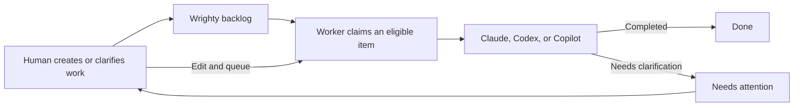

# Wrighty

Wrighty coordinates work between developers and locally running
[AI coding agents](docs/reference/agent-skills.md#supported-ai-agents) — Claude Code, Codex, and
GitHub Copilot. Agents discover, claim, update, and finish shared work through a predictable CLI;
developers steer the same backlog from the CLI or a local web dashboard.

Wrighty is useful when:

- one or more local AI agents need a shared, claim-aware backlog while working in a project;
- developers want that backlog stored as human-readable files alongside the source code;
- developers and agents working from different machines need to coordinate through GitHub without
  claiming the same work; or
- scripts and agent workflows need a stable CLI with compact and JSON output instead of
  backend-specific tracker operations.

Day-to-day commands are backend-neutral: choose local Markdown files for work on one shared
filesystem, or GitHub Issues plus Projects when coordination spans machines. Your data stays
yours either way — plain Markdown in your repository, or your own issues.

## Install

macOS ARM64 or Linux x64/ARM64, from the shared Highbyte Homebrew tap:

```shell
brew install highbyte/tap/wrighty
```

Windows x64/ARM64, from the shared Highbyte Scoop bucket:

```powershell
scoop bucket add highbyte https://github.com/highbyte/scoop-bucket
scoop install highbyte/wrighty
```

Verify with `wrighty --help`.

## Wrighty in 90 seconds

From a Git checkout, create an explicitly agent-eligible item, preview the unattended run, process
one item in an isolated worktree, and open the local dashboard:

```shell
wrighty init --backend local-markdown
wrighty create \
  --title "Validate user names" \
  --body "Reject empty user names and add tests." \
  --auto \
  --agent claude

wrighty worker --dry-run --once --workspace-mode worktree
wrighty worker --once --workspace-mode worktree
wrighty web
```

The live worker command warns and asks for confirmation before starting the agent. Replace
`claude` with `codex` or `copilot` when preferred. Outside a Git checkout, use
`--workspace-mode current` instead.



## When the agent gets stuck, the session survives

The loop Wrighty is built around: an unattended agent that stops for clarification does not lose
its work, and answering it takes one edit.

1. A worker runs an item headlessly. If the agent exits without finishing — usually because it
   needs a decision only you can make — the item is marked **needs attention** and the vendor
   session address is recorded durably.
2. Run `wrighty web`, open the item, choose **Take over for editing…**, and answer the question by
   editing the title or body.
3. Choose **Save and queue for worker** — a continuous worker resumes *the same vendor session*
   with your clarification, keeping everything the agent had already figured out. Or choose
   **Save and hand back to _Agent_** for the interactive resume command instead.

The CLI equivalent is atomic:

```shell
wrighty edit <id> --takeover --yes --body-file clarified.md --requeue
wrighty worker --item <id> --yes
```

Claims are leases with fencing: a displaced claimant's next write fails with a structured error
instead of silently clobbering yours, and a crashed agent's claim simply expires. Recorded
sessions survive claim release and expiry. The
[workflow guide](docs/workflows.md) walks every path, including where it is safe to switch
between CLI and dashboard.

## Working with agents interactively

Install the bundled skill, then invoke it explicitly from your agent:

```shell
wrighty skill install --agent all
```

```text
/wrighty Pick the next available item, implement it, run its tests, and finish it.
$wrighty Help me turn this feature idea into a well-scoped work item. Show me the proposed
title and body before creating it.
```

The skill directs agents to mutate tracker state only through the CLI and to branch on structured
error codes. See [Agent skills](docs/reference/agent-skills.md) for per-surface activation and
update mechanics.

## Ownership in four rules

1. Reading (`list`, `get`, dashboard) never requires a claim.
2. Mutating requires the exact claim handle; a superseded handle fails with `CLAIM_STALE`.
3. On this installation you can always recover: `wrighty edit <id> --takeover` to clarify,
   `wrighty worker --item <id>` to continue the recorded session.
4. Another installation's active claim always wins until its lease expires.

[Claims and ownership](docs/reference/claims.md) covers attribution, fencing guarantees per
backend, and the lower-level escape hatches.

## Documentation

| Topic | Reference |
| --- | --- |
| Workflows end to end (CLI and dashboard) | [docs/workflows.md](docs/workflows.md) |
| Backends, `wrighty init`, `.wrighty.json` | [Configuration](docs/reference/configuration.md) |
| IDs, create, edit, move, archive, import | [Work items](docs/reference/work-items.md) |
| Claims, attribution, fencing, takeover | [Claims and ownership](docs/reference/claims.md) |
| Unattended processing and session resume | [Autonomous worker mode](docs/reference/worker.md) |
| The local web dashboard | [Local web dashboard](docs/reference/web-dashboard.md) |
| Skill installation per agent surface | [Agent skills](docs/reference/agent-skills.md) |
| What is stored where, version control | [Storage and version control](docs/reference/storage.md) |
| Physical item metadata per backend | [Item metadata](docs/item-metadata/README.md) |
| Architecture and protocol rationale | [Design documents](docs/design/) |

## Development

The implementation is guided by the
[original design](docs/design/agent-facing-work-item-tracker-cli.md) and the related public
design documents in [`docs/design/`](docs/design/).

Build and test with the .NET 10 SDK:

```shell
dotnet build Wrighty.slnx
dotnet test Wrighty.slnx
```

See [Developing Wrighty](docs/development/README.md) for prerequisites, the development CLI
activation workflow, package-manifest and live GitHub tests, and release instructions.

## License

Wrighty is licensed under the [MIT License](LICENSE).
