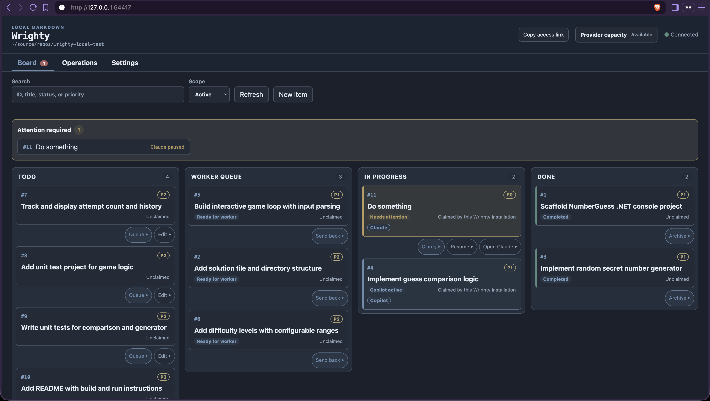
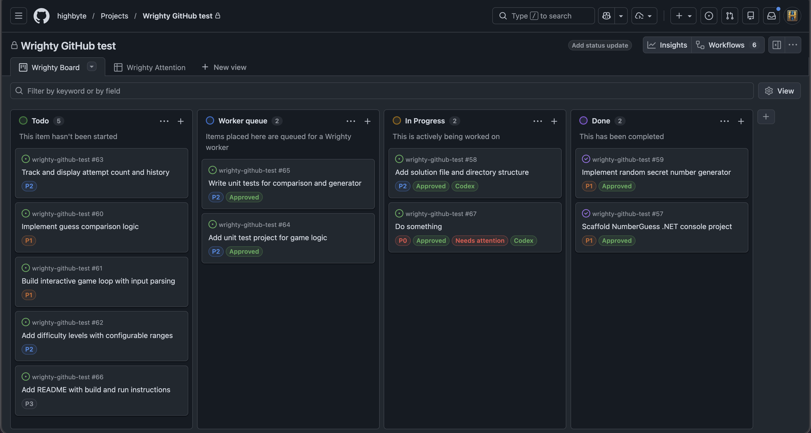
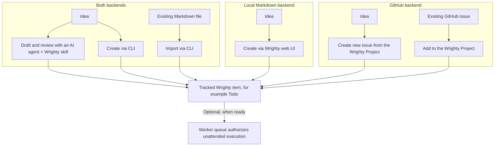
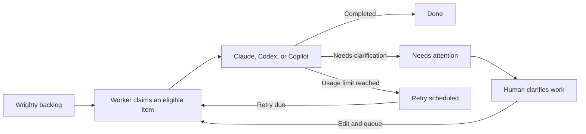

# Wrighty

**Turn the coding-agent CLIs you already use into a controlled, resumable work queue.**

Wrighty coordinates [Claude Code, Codex, and GitHub Copilot](docs/reference/agent-skills.md#supported-ai-agents)
running on your machine. You explicitly queue work, preview what will launch, optionally isolate it
in a Git worktree, and keep enough durable state to recover when the agent stops. Wrighty needs no
hosted Wrighty service: work items live as human-readable Markdown on one filesystem, or in the
GitHub repository and Project you choose.

Wrighty is the coordination layer around those tools, not another model, hosted agent service, or
replacement for GitHub. The vendor CLI still performs the work; Wrighty supplies the queue,
ownership, workspace lifecycle, and recovery path.

## Why use Wrighty?

Use an agent CLI directly for one supervised task. Use Wrighty when you want unattended work to
keep moving without restarting from scratch whenever an agent stops:

- **Keep a queue of work moving.** Put chosen items in the dedicated **Worker queue** and let a
  continuous worker process them one at a time with Claude, Codex, or Copilot.
- **Resume after usage limits.** When retryable subscription exhaustion or rate limiting interrupts
  unfinished work, Wrighty retains the recorded session and workspace and schedules a same-agent
  continuation. A running or later-started continuous worker resumes it when the retry is due.
- **Hand work to another agent instead of waiting.** Optionally start a new agent session in the
  retained workspace, carrying bounded, redacted context from the previous run when available and
  workspace evidence otherwise.

## Where Wrighty has the most impact

| Situation | What Wrighty does |
| --- | --- |
| **You have several tasks ready for an agent** | Put the selected work in the **Worker queue** and leave a [continuous worker](docs/reference/worker.md) running. It processes one item at a time and also picks up queued resumable sessions. |
| **An agent reaches a retryable usage limit mid-task** | Preserve the unfinished session and workspace, schedule a bounded retry, and let a running or later-started worker continue with the same agent when the retry is due. See [subscription-limit recovery](#handle-subscription-limits-without-losing-the-work). |
| **Another agent can continue sooner** | Hand the retained workspace to another configured and installed agent. The target starts a new session with bounded, redacted context when available and workspace evidence otherwise. See [agent handoff](docs/reference/usage-recovery-and-agent-handoff.md#cross-agent-handoff). |

## Choose where the backlog lives

| Backend | Best fit | What you get |
| --- | --- | --- |
| **Local Markdown** | Solo work or multiple processes sharing one filesystem | Reviewable files in the configured local store, strong cooperative fencing for Wrighty-mediated mutations, and the full local board and editor. |
| **GitHub Issues + Projects** | Developers or workers coordinating across computers | A GitHub-native shared backlog with Project policy and approval fields, dispatch labels, status guidance, and best-effort stale-write detection. An already in-flight GitHub API write cannot be prevented. |

Core work-item and worker commands are backend-neutral; initialization, approval, and web
capabilities intentionally differ. See [Configuration](docs/reference/configuration.md) for setup
requirements and the exact coordination guarantees.

## What Wrighty looks like

With Local Markdown, `wrighty web` provides the board, item editor, recovery actions, and local
worker visibility:

[](docs/assets/screenshots/local-markdown-web-ui-board.png)

With the GitHub backend, the configured GitHub Project remains the shared board. Wrighty adds the
queue, policy, claim, and recovery state used by local workers on each computer:

[](docs/assets/screenshots/github-board.png)

See [Wrighty workflows](docs/workflows.md) for the actions behind these views and the
[Web console](docs/reference/web-console.md) for the backend-specific web surfaces.

## Install

macOS ARM64 or Linux x64/ARM64, from the shared Highbyte Homebrew tap:

```shell
brew install highbyte/tap/wrighty
```

Windows x64/ARM64, from the shared Highbyte Scoop bucket:

```powershell
scoop bucket add highbyte https://github.com/highbyte/scoop-bucket
scoop install highbyte/wrighty
```

Verify with `wrighty --help`.

## Initialize Wrighty

For the quickest local setup, run this from your project:

```shell
wrighty init --backend local-markdown
```

This creates a human-readable Markdown backlog. Choose the
[GitHub backend](docs/reference/configuration.md#initialize-the-github-backend) instead when workers
need to coordinate across computers.

## Bring work into Wrighty your way

Wrighty does not prescribe how you discover, discuss, or document work. Keep using your existing
requirements-management or feature-specification system, or start with only a rough idea. Bring work into
Wrighty when tracking or agent execution becomes useful:

- **Draft the work item with an AI agent.** Use Claude, Codex, or Copilot interactively with the
  Wrighty skill to reason about the requirement, draft the title and Markdown specification, and
  review it before the agent creates the Wrighty item. Follow the
  [collaborative authoring workflow](docs/workflows.md#collaboratively-author-a-substantial-work-item).
- **Create it directly from the CLI.** Use `--body` for a short description or `--body-file` for an
  existing requirement or feature specification. See
  [work-item creation](docs/reference/work-items.md#work-item-ids-and-creation).
- **Import existing Markdown.** Import one document, or with Local Markdown recursively import a
  directory, with a dry run available before writing. See
  [importing and adopting](docs/reference/work-items.md#importing-and-adopting).

Each backend also has native intake paths:

| Backend | Starting point | Native path |
| --- | --- | --- |
| **Local Markdown** | New work item | Run `wrighty web`, choose **New item**, select **Todo** when you do not want unattended execution yet, and choose **Create item**. |
| **GitHub** | New issue | Create a new issue from the configured Wrighty Project's **Todo** group or column. If the generated **Wrighty task** Issue Form has been published, select it in the new-issue dialog. |
| **GitHub** | Existing issue in the configured repository | Add the issue to the configured Wrighty Project. Project membership makes it a Wrighty item without copying it or changing its issue number or content. The corresponding CLI path is [`wrighty adopt`](docs/reference/work-items.md#importing-and-adopting). |

See the [interactive UI workflow](docs/workflows.md#interactive-ui) for both backends and
[work-item creation and membership](docs/reference/work-items.md#work-item-ids-and-creation) for
GitHub's tracking rule.

With the default Local Markdown setup above:

```shell
wrighty create --status Todo --title "Fix empty names" --body "Reject empty values and add tests."
wrighty create --status Todo --title "Add retry policy" --body-file feature-spec.md

wrighty import existing-feature.md --force-status Todo --dry-run
wrighty import existing-feature.md --force-status Todo
```

These examples create tracked **Todo** items without authorizing unattended execution. If you
customize the workflow, replace `Todo` with a configured status that is not a worker source queue.
Moving an item to **Worker queue** through Wrighty is the later, explicit authorization step; when
the item is already ready for a worker, `wrighty create --auto ...` authorizes it at creation.


```mermaid
flowchart TB
    subgraph Both["Both backends"]
        Idea["Idea"] --> Agent["Draft and review with an AI agent + Wrighty skill"]
        Idea --> CLI["Create via CLI"]
        Markdown["Existing Markdown file"] --> Import["Import via CLI"]
    end

    subgraph Local["Local Markdown backend"]
        LocalIdea["Idea"] --> Web["Create via Wrighty web UI"]
    end

    subgraph GitHub["GitHub backend"]
        GitHubIdea["Idea"] --> Form["Create new issue from the Wrighty Project"]
        ExistingIssue["Existing GitHub issue"] --> Add["Add to the Wrighty Project"]
    end

    Agent --> Item["Tracked Wrighty item, for example Todo"]
    CLI --> Item
    Import --> Item
    Web --> Item
    Form --> Item
    Add --> Item
    Item -->|Optional, when ready| Queue["Worker queue authorizes unattended execution"]
```

## Your first unattended run

This continues the default Local Markdown setup above and uses Claude Code; install and sign in to
that CLI first, or replace `claude` with `codex` or `copilot`. From a Git checkout, install the
Wrighty skill at user scope so it is available inside new worktrees, then create an explicitly
agent-eligible item. Replace the example with a small, observable task that fits your repository:

```shell
wrighty skill install --agent claude --scope user
wrighty create \
  --title "Validate user names" \
  --body "Reject empty user names and add tests." \
  --auto \
  --agent claude

wrighty list
```

Dry-run the selected item and sanitized invocation before allowing anything to run:

```shell
wrighty worker --dry-run --once --workspace-mode worktree
```

The default `workspace` permission profile still allows commands and network access. Codex and
Copilot confine file writes to the workspace; Claude currently provides only partial tool-level
narrowing, which Wrighty reports before launch. See
[Spawned-agent permissions](docs/reference/worker.md#spawned-agent-permissions).

If the candidate, resolved agent, and invocation are what you intended, run the live command. It
reports effective permission enforcement and workspace details before asking for confirmation, then
processes at most one item:

```shell
wrighty worker --once --workspace-mode worktree
wrighty status
wrighty web
```

The dry run does not claim the item, create a worktree, or start the agent. The live worker warns
and asks for confirmation. By default, a completed worktree run retains the worktree and instructs
the agent to leave its changes uncommitted for review; `wrighty status` and `wrighty web` show the
recorded outcome and where to inspect it. Blocked work appears as **Needs attention**. Commit or
otherwise preserve accepted code changes yourself. Review and commit the generated `.wrighty.json`,
tracker `.gitignore`, and work-item Markdown if you want the local backlog to travel with the
repository. Outside a Git checkout, use `--workspace-mode current` instead.


```mermaid
flowchart LR
    Backlog["Wrighty backlog"] --> Worker["Worker claims an eligible item"]
    Worker --> Agent["Claude, Codex, or Copilot"]
    Agent -->|Completed| Done["Done"]
    Agent -->|Needs clarification| Attention["Needs attention"]
    Agent -->|Usage limit reached| Retry["Retry scheduled"]
    Retry -->|Retry due| Worker
    Attention --> Human["Human clarifies work"]
    Human -->|Edit and queue| Worker
```

### Choose your next step

- Follow [Wrighty workflows](docs/workflows.md) to switch safely between the CLI and web console.
- Configure a [continuous unattended worker](docs/reference/worker.md) to process a bounded queue.
- Use the [GitHub backend](docs/reference/configuration.md#initialize-the-github-backend) when
  workers need to coordinate across computers.
- Install and invoke the [agent skill](docs/reference/agent-skills.md) for supervised, interactive
  work.
- Tune model and reasoning choices with [execution profiles](docs/reference/execution-profiles.md).

## Recover a blocked agent without starting over

Wrighty keeps the retained workspace and resume information when an unattended agent needs a
decision, so you can clarify the work and continue it.

1. A worker runs an item headlessly. If the agent exits without finishing — for example because it
   needs a decision only you can make — the item is marked **needs attention** and the vendor
   session address is recorded durably.
2. With the Local Markdown backend, run `wrighty web` and open the item. If an external permission
   or configuration fix is enough, choose **Queue for worker** directly. If the requirements need
   clarification, choose **Take over for editing…** and update the title or body.
3. After editing, choose **Save and resume automatically** to queue *the same vendor session* so an
   active or subsequently started continuous worker can resume it with its existing vendor-session
   context and retained workspace, subject to the vendor's own context limits. To continue it
   yourself instead, open **More actions…** and choose **Save and show manual _Agent_ resume
   command**.

The CLI works with either backend. To hand the clarified session back to an already-running
continuous worker, combine takeover, editing, and requeueing:

```shell
wrighty edit <id> --takeover --yes --body-file clarified.md --requeue
```

To continue immediately instead, keep the human claim after editing and transfer that exact item to
a one-item worker:

```shell
wrighty edit <id> --takeover --yes --body-file clarified.md
wrighty worker --item <id> --yes
```

Claims are leases with backend-appropriate fencing. Local Markdown prevents stale writes after a
takeover; on GitHub, Wrighty detects stale cooperating mutations but cannot prevent an already
in-flight API write from landing. A crashed agent's claim expires, while recorded sessions survive
claim release and expiry. The
[workflow guide](docs/workflows.md) walks every path, including where it is safe to switch
between CLI and web console.

## Handle subscription limits without losing the work

Agent subscription limits can be reached mid-task. Wrighty treats that as a scheduling problem
rather than a lost session.

- **With the same agent**, under the default retry policy, an unfinished run classified as retryable
  subscription exhaustion or rate limiting is scheduled for the provider's stated reset — or a
  bounded retry when the provider does not state one. A separately running continuous worker
  resumes it when the retry is due; otherwise a later worker invocation can pick it up after that
  time.
- **With another configured and installed agent**, opt-in handoff can continue the work instead of
  waiting. The retained workspace stays put and the target starts a fresh session there, with
  bounded, redacted context when source-session export is available and workspace-only evidence
  otherwise.
- **Either way the recovery state is visible** in the CLI and, depending on the backend, the Local
  Markdown board or GitHub labels, fields, and status comment. Exact retry, provider, session, and
  workspace state stays on the recording installation.

Automatic cross-agent handoff is opt-in; the explicit `worker --handoff` command is itself operator
authorization. Either way, a handoff is a new session in the same workspace, not a vendor session
imported into another vendor. See
[Usage recovery and agent handoff](docs/reference/usage-recovery-and-agent-handoff.md) for the
failure classification, retry schedule, provider circuit, and per-vendor support.

## Work with an agent interactively

Install the bundled skill, then invoke it explicitly from your agent:

```shell
wrighty skill install
```

By default, Wrighty installs the bundled skill for every supported agent CLI found on the current
machine. Pass
`--agent all` to prepare every supported destination regardless of local installation.

```text
# Claude Code
/wrighty Pick the next available item, implement it, run its tests, and finish it.

# Codex CLI, Desktop, or IDE extension
$wrighty Help me turn this feature idea into a well-scoped work item. Show me the proposed
title and body before creating it.

# Copilot surfaces with skill commands
/wrighty Pick the next available item, implement it, run its tests, and finish it.
```

If a Copilot surface has no skill command, name the Wrighty skill in the prompt. The skill directs
agents to mutate tracker state only through the CLI and to branch on structured error codes. See
[Agent skills](docs/reference/agent-skills.md) for per-surface activation and update mechanics.

## Key capabilities

- **Controlled dispatch:** a one-gesture Worker queue plus per-item agent and execution policies;
  `--once`, `--max-items`, `--idle-timeout`, and item timeouts for bounded processing.
- **Review-first workspaces:** current-checkout, explicitly shared, or per-item worktree modes;
  vendor-mapped permission profiles with their effective enforcement reported; configurable commit
  and integration guidance.
- **Durable continuation:** needs-attention state, last-run details, same-session clarification and
  resume, deferred usage retry, provider circuits, and automatic or explicitly requested
  cross-agent handoff.
- **Claim-aware coordination:** leases, exact claim handles, takeover, and stale-writer detection,
  with [backend-specific fencing guarantees](docs/reference/claims.md).
- **Human and agent surfaces:** a scriptable CLI with compact and JSON output plus NDJSON worker
  lifecycle events; a Local Markdown board with drag-and-drop, quick actions, and claim-aware
  editing; GitHub Project policy and context-approval controls; and a bundled agent skill.
- **Portable execution profiles:** repositories can ask for stable names such as `economy`,
  `balanced`, or `deep`; built-in mappings work without setup and each user can override their
  meaning with locally available agent settings.

## Ownership in four rules

1. Reading (`list`, `get`, web console) never requires a claim.
2. Claim-protected edits, moves, completion, archival, release, and renewal require the exact claim
   handle; a superseded handle fails with `CLAIM_STALE`.
3. On the recording installation, `wrighty edit <id> --takeover` recovers ownership for
   clarification, and `wrighty worker --item <id>` continues a still-usable recorded session.
4. Another installation's active claim always wins until its lease expires.

[Claims and ownership](docs/reference/claims.md) covers attribution, fencing guarantees per
backend, and the lower-level escape hatches.

## Documentation

| Topic | Reference |
| --- | --- |
| Complete behavior reference | [Wrighty reference index](docs/reference/README.md) |
| Workflows end to end (CLI and web console) | [docs/workflows.md](docs/workflows.md) |
| What each action supports in the web console, GitHub, and CLI | [Operator actions by surface](docs/reference/operator-actions.md) |
| Backends, `wrighty init`, `.wrighty.json` | [Configuration](docs/reference/configuration.md) |
| User-scoped settings (`wrighty config`, host label) | [User settings](docs/reference/user-settings.md) |
| IDs, create, edit, move, archive, import | [Work items](docs/reference/work-items.md) |
| Claims, attribution, fencing, takeover | [Claims and ownership](docs/reference/claims.md) |
| Unattended processing and session resume | [Autonomous worker mode](docs/reference/worker.md) |
| Choosing a model and reasoning effort per run | [Execution profiles](docs/reference/execution-profiles.md) |
| Quota exhaustion, deferred retry, agent handoff | [Usage recovery and agent handoff](docs/reference/usage-recovery-and-agent-handoff.md) |
| The web console | [Web console](docs/reference/web-console.md) |
| Skill installation per agent surface | [Agent skills](docs/reference/agent-skills.md) |
| What is stored where, version control | [Storage and version control](docs/reference/storage.md) |
| Physical item metadata per backend | [Item metadata](docs/item-metadata/README.md) |
| Architecture and protocol rationale | [Design documents](docs/design/) |

## Development

The implementation is guided by the
[original design](docs/design/agent-facing-work-item-tracker-cli.md) and the related public
design documents in [`docs/design/`](docs/design/).

Build and test with the .NET 10 SDK:

```shell
dotnet build Wrighty.slnx
dotnet test Wrighty.slnx
npm test
```

See [Developing Wrighty](docs/development/README.md) for prerequisites, the development CLI
activation workflow, package-manifest and live GitHub tests, and release instructions.

## License

Wrighty is licensed under the [MIT License](LICENSE).
