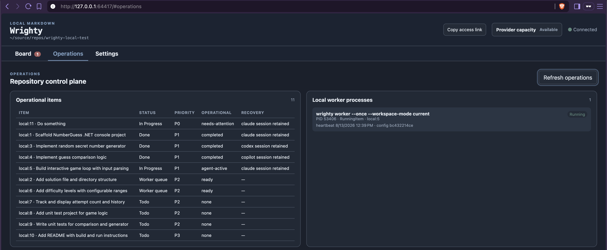
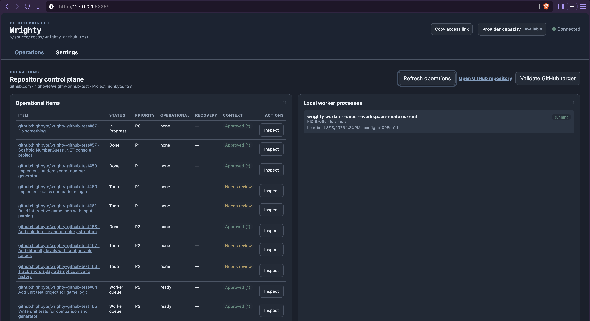
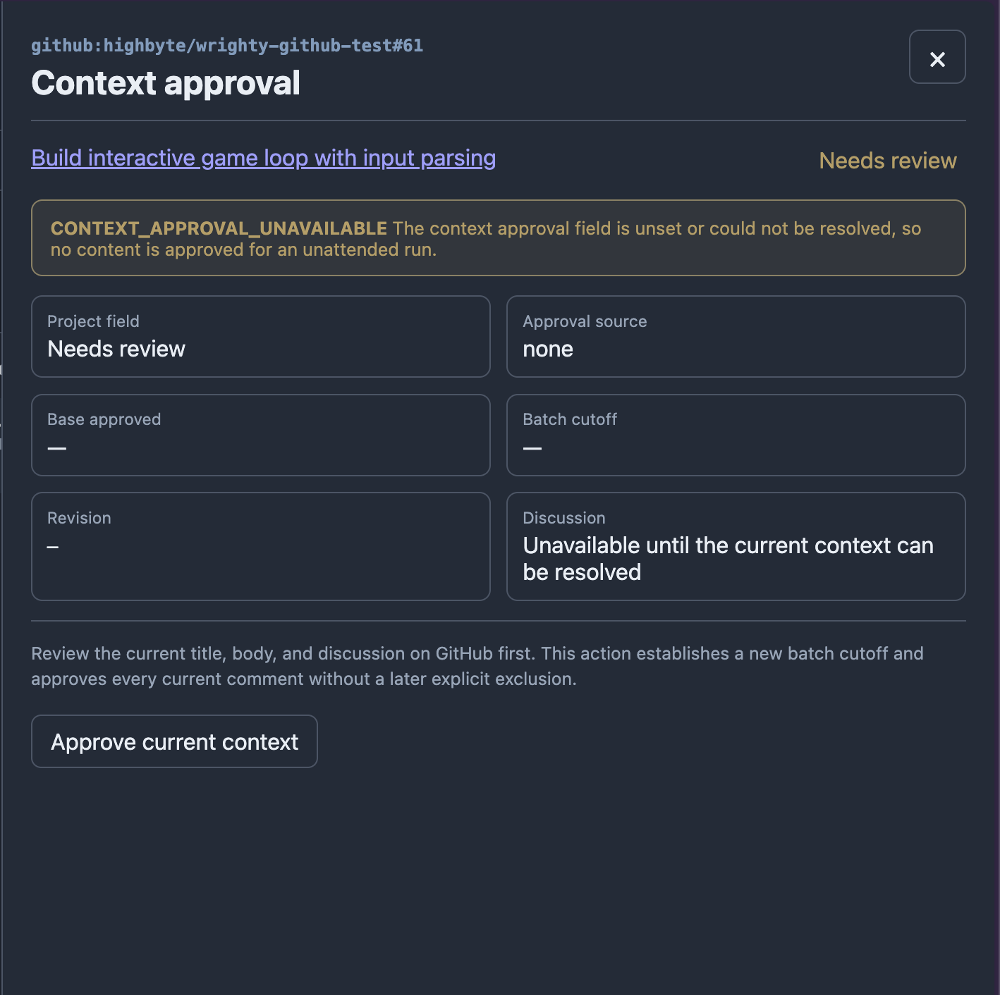

# Web console

`wrighty web` is one secured, machine-local operations application for both tracker backends. Run
it from the directory containing `.wrighty.json` or any child directory:

```shell
wrighty web
```

Wrighty binds an ephemeral port on `127.0.0.1` and, when IPv6 is available, `::1`; prints the IPv4
loopback address; and opens the web console in the default browser. Use a fixed port or keep the
browser closed when needed:

```shell
wrighty web --port 8080
wrighty web --no-open
```

The console is organized as page-level tabs under the header, so every section is discoverable
without scrolling: **Board** (Local Markdown only), **Operations**, and **Settings**. The GitHub
backend has no board and opens on **Operations**. A needs-attention badge on the Board tab (the
Operations tab for GitHub) keeps paused items visible from any tab, and the selected tab is kept in
the URL fragment so a refresh or shared link reopens the same section.

Both backends show typed repository configuration, stored-versus-active revisions, local worker
processes, operational item groups, retained-session recovery state, and agent capacity. The
header names the actual local operating-system host beside the workspace path, which makes a
console reached through a VPN address or reverse proxy unambiguous without deriving identity from
the HTTP `Host` header. The
GitHub surface does not edit issue content or Project fields: use the configured GitHub repository
and Project for those. It can operate Wrighty's retained session and claim metadata without turning
the console into a second item editor. The repository and Project names below **Repository control
plane** link directly to those GitHub surfaces. Its **Validate GitHub target**
action explicitly runs the read-only initialization check; merely opening or refreshing the
console does not create or change GitHub resources.

Local Markdown adds its existing board, item viewer, and claim-aware editor to the shared
operations surface. The item viewer offers a confirmed **Delete** action only while an item is
unclaimed and has never entered worker or agent processing; deletion permanently removes its local
Markdown file and returns to the board. Items with processing history use **Archive** instead.
GitHub never renders or authorizes those Local-only item mutation routes.

[](../assets/screenshots/local-markdown-web-ui-operations.png)

The Local Markdown Operations tab complements the board with process and recovery state; it does
not replace the board.

## Start, observe, and stop workers

**Operations → Local worker processes** shows both kinds of local worker:

- **Hosted by this web console** is a background task owned by the current `wrighty web` process.
  Every **Start worker** action adds another generic continuous worker using the configuration
  snapshot loaded at web startup. Closing, refreshing, or navigating away from the browser does
  not stop them. Stopping the `wrighty web` process does.
- **Started outside the web console** is a `wrighty worker` process launched by a terminal, service
  manager, or operating-system startup mechanism. That original process remains its owner.

Every current worker card shows origin, PID and verified liveness, lifecycle state, current item,
and current agent. Older worker versions that did not publish the agent say so instead of guessing
from the item or claim. Stale and unverifiable records label item, agent, and state as last-reported
facts. The header's **Workers** button reports the verified running count from every tab, labels an
idle pool, and highlights how many workers are actively processing an item. Stale or unverifiable
registrations are called out separately. Select the button to open and focus **Operations → Local
worker processes**. The current hosted worker card exposes a bounded structured operational log. Opening it
starts at the newest event. Normal and manual Operations refreshes continue updating the whole
worker card while preserving the disclosure and its scroll position for the same run. Updates
follow the tail until the operator scrolls back, at which point Wrighty preserves that reading
position. Wrighty retains at most 200 entries or 128 KiB for the run and consolidates
consecutive idle heartbeats into the latest idle entry. The log contains allowlisted lifecycle
fields only; Wrighty does not retain prompts, model responses, commands, arguments, environment
values, session IDs, stdout, or stderr there. Externally started workers keep their logs in their
owning terminal or service.

Stopping is cooperative and always confirmed:

- **Stop worker** on an idle worker closes intake and exits without claiming another item.
- **Stop after current item** is the normal busy-worker action. It lets the current agent session,
  same-run continuation, and Wrighty bookkeeping finish, then closes intake before another claim.
- **Stop now…** is the danger action. Wrighty terminates the active agent process tree, then uses a
  separate bounded finalizer. A finished item wins. Otherwise its workflow status is left where it
  is, dispatch becomes `needs-attention`, any session/workspace is retained, and no automatic retry
  is scheduled.

External stop requests are versioned machine-local control records. Before creating one, the web
console freshly verifies the run ID, PID, process-start identity, configuration hash, origin, and
advertised control protocol. It never sends an unverified operating-system kill. A prominent
confirmation also reminds the operator that a service manager may restart an externally owned
worker.

Hosted workers follow the same workspace concurrency rules as workers started from a terminal.
In `current` mode they may all remain registered, but the exclusive workspace lock lets only one
claim or process work at a time; the others report **Waiting for workspace** and retry. `worktree`
mode gives concurrent workers isolated checkouts, while `shared` explicitly accepts concurrent
access to the same checkout. A repository-settings save is atomically applied to subsequent web
requests and workers started from that web console. Already-running workers retain the immutable
configuration revision they started with and are reported as stale until restarted. If
`.wrighty.json` is edited outside the console, use **Refresh settings** before starting another
hosted worker; changing the backend remains a web-process restart boundary.

The **Operational items** table has its own search, sorting, and filters for workflow and
operational status, priority, requested agent, recovery, recency, and—where available—context
state. Agent choices come from the registered adapter inventory. Local Markdown offers its complete
configured priority and workflow-status lists; GitHub offers the values observed in the bounded
Operations window. Local Markdown also offers claimant-kind and claim-ownership filters because its
projection is complete; GitHub deliberately omits them rather than loading every issue conversation
and presenting partial results. **Requested agent** means the item's execution policy, not the agent
currently holding a claim. Active filters appear as individually removable chips with one contextual
**Clear all** action. The Item, Title, Workflow status, Priority, Requested agent, Updated, and
Operational status headings select a sort field and toggle ascending/descending order; **Default
order** restores Wrighty's operational-priority ranking. These controls are independent
from the Board and reset on page reload.

Operations organizes a bounded window. Wrighty asks the backend for one item beyond the displayed
100, trims the sentinel, and shows a notice when more items exist. In that case sorting, filtering,
and the visible count describe the loaded 100-item window, not the entire repository. Refine the
filters or use the backend's native tracker when repository-wide discovery is required.

Board cards distinguish a worker that has claimed an item from one that has started its agent. A
neutral **Worker preparing** card means the worker owns the claim while it prepares the workspace
and validates the launch. After the operating-system process starts, the card changes to a raised,
outlined **Live — Agent working** treatment with a full-width execution banner, using the selected
agent's display name. Its motion becomes static when the browser requests reduced motion. Older
claims that do not record an execution phase continue to display as working for compatibility.

## Open a retained session from Operations

When an operational item needs attention, or is Done with no active claim, and this installation
holds its complete retained session address, its **Actions** cell offers **Open _Agent_**. Choose
whether to continue in a new CLI terminal or in the vendor's Desktop app. The chooser is shared by
the Local Markdown and GitHub backends and supports Claude, Codex, GitHub Copilot, and OpenCode according to
the installed runtime and platform capabilities described below.

GitHub Operations hydrates exact claim and session state only for needs-attention and Done
candidates. Its routine Project list stays a lightweight summary read rather than loading every
issue conversation. The action appears only on the Wrighty installation that recorded the complete
local session; it is hidden when another installation owns the item, when a Done item still has an
active claimant, or when no supported local launch route is available.

Needs-attention work remains managed: CLI receives a fenced agent claim, while Desktop is supervised
under a human claim. Done work with no active claim is deliberately different. Wrighty considers it
outside the execution lifecycle, opens either client without acquiring a claim or passing claimant
credentials, and leaves responsibility for further conversation and workspace changes with the
operator. Wrighty never releases or bypasses an active claim merely because an external tracker
changed the status to Done.

## GitHub context approval

For the GitHub backend, **Operations → Operational items** includes a compact
**Context** projection from the Project field. Apart from the selective needs-attention/Done
recovery read described above, it does not load issue conversations during routine web console polling.
Choose **Inspect** on one item to perform the full, content-free approval read in a right-side
details drawer. The drawer shows the current result code, Project-field state, approval source and
cutoffs, revision digest, decision counts, and links to comments still awaiting a decision. The
initial **Approved (*)** badge and its tooltip identify the lightweight projection; after
inspection, that row shows the authoritative result for the inspected revision without the
asterisk.

[](../assets/screenshots/github-web-ui-operations.png)

The GitHub Operations tab is a local control plane beside GitHub's Project board, not a second item
editor.

The details drawer offers **Approve context** or **Reapprove context**. This protected, confirmed POST
cycles the Project field through **Needs review** and back to **Approved**, establishing a new base
approval and batch cutoff, then reloads the same diagnostics the next worker launch will use. The
action does not claim the item, change execution policy, or start a worker. A later title or body
edit remains stale until the edit-invalidation workflow resets the Project field or a current
approval supersedes that edit.

<a href="../assets/screenshots/github-web-ui-operations-context-approve.png"></a>

This example is deliberately in **Needs review**: unresolved approval means no GitHub content is
sent to an unattended agent until an authorized operator reviews and approves the current context.

Local Markdown deliberately has no Context column or approval action. Its machine-local title and
body are approved by definition, and the backend has no discussion stream to decide.

The **Settings** tab uses a distinct secondary navigation so its three sections do not form one long
page: **Repository**, **User**, and **Storage**. Repository settings lead with the two policies used
for every launch: **Worker** covers workspace and queue authorization; **Agent** covers
agent selection, requirements assessment, permissions, per-agent overrides, and execution profiles.
The remaining groups are collapsed until needed. **Agent usage recovery** comes immediately after
Agent because retry and cross-agent handoff are core Wrighty behavior, followed by **Workflow**,
**Worktrees and branches**, **Completion**, the selected backend, and **Web console**. Workflow also
contains the repository-wide claim-expiry policy used by worker, CLI, human-editing, and web claims.
GitHub keeps
its context trust, reactions, continuation, handover, and Project-retention controls together;
Local Markdown keeps its statuses and priorities together. Initialization-only backend identity and
Project field mappings remain visible but read-only.

**Agent usage recovery** edits the complete `worker.usageFailure` policy: first response, retry
timing and attempt limits, post-retry handoff behavior, reset grace, and the fallback order for each
supported agent. Profile names and fallback agents use compact token pickers instead of comma
editing. Choice controls whose consequences are not obvious have adjacent information buttons;
their popovers close when focus moves to another choice or the operator clicks elsewhere. Profiles
may be created from the picker; fallback tokens preserve priority order and expose a swap action.
The profile default updates with unsaved token changes, while user-mapping choices update from the
stored vocabulary after a successful save.
Each submission carries the raw-file revision and edits only the configuration path loaded at
process startup; the browser cannot supply a different path. A concurrent manual or CLI edit
returns `CONFIG_CONFLICT`. A successful shared-policy save normally does not hot-reload this
process or running workers: the console separately identifies whether the running web console and
any detected local worker processes still use an earlier revision, then gives restart guidance for
each. When no worker process needs restarting, the message says so explicitly. Agent testing
overrides are the exception and are read on demand.

Repository **Advanced/testing** settings simulate each registered agent's availability, capacity
probe result, and implementation result. **Pretend not installed** changes Wrighty's runtime view
without altering the executable or `PATH`, affecting installation-dependent UI, checks, probes,
and launches. A capacity-probe simulation can report **Available**, **Usage exhausted**, or
**Rate limited** consistently to the Agents overlay, CLI provider probe, and worker capacity gate.
It is labelled **Simulated**, does not start the vendor CLI, and never replaces the
installation-wide real-capacity cache. An implementation failure enters the normal retry, handoff,
or operator-attention path while agent health checks, capacity probes, and restricted
requirements-readiness turns stay real. Synthetic implementation usage failures do not alter the
installation-wide provider-capacity circuit. Active
simulations are counted in the collapsed group and can all be turned off with one action. Because
these settings are stored in `.wrighty.json`, they affect every Wrighty host using the repository.
Saving or clearing a simulation does not require restarting the web console or workers; it applies
to the next relevant check, capacity decision, probe, or implementation launch.
Only **Usage exhausted** and **Rate limited** enter `worker.usageFailure`; each agent row shows the
effective retry/handoff policy and fallback order. Authentication, billing, and permission
simulations stop for operator attention. A configured fallback order does not itself enable
handoff: use `action: "handoff"` for immediate handoff, or `allowCrossAgentHandoff: true` to hand
off after same-agent retries are exhausted.
Malformed repository configuration prevents normal startup and must be repaired manually.

The same tab includes a read-only **Storage locations** table. It shows the effective absolute
paths, lifecycle, backend applicability, and existence of Wrighty-owned repository content,
user configuration, machine-local runtime state, cache, temporary locks, and managed credential
files. Credential paths are visible to the authenticated local operator, but credential values are
never displayed. See the centralized [storage reference](storage.md).

## Viewing the web console from another machine

Keep Wrighty on loopback whenever a tunnel or browser relay is available. A cmux remote-SSH
workspace can route its browser pane to the remote loopback service directly. With ordinary SSH,
forward a local port to the remote loopback endpoint instead of exposing Wrighty on a network
interface.

When no tunnel is available, an operator can deliberately bind one specific address assigned to the
machine, such as its Tailscale address:

```shell
wrighty web --bind 100.100.100.100 --port 8080
```

Wrighty refuses `0.0.0.0`, `::`, and addresses not assigned to a local interface. A non-loopback
server still uses plaintext HTTP and prints a warning on every start. Token authentication remains
enabled, but possession of the launch URL grants web console access; use this mode only on an
encrypted or trusted transport such as Tailscale.

Direct access by an intentional DNS name requires each exact name to be allowed:

```shell
wrighty web --bind 100.100.100.100 --allow-host wrighty.example.ts.net
```

`--allow-host` is repeatable and accepts no wildcard. It extends both Host and direct-HTTP mutation
Origin validation; it does not change the listening interface or infer DNS names. Bind address,
allowed hosts, port, browser opening, authentication, token lifetime, and public URL are
per-invocation machine settings. They are not stored in `.wrighty.json` or managed by
`wrighty config`.

## Authentication and token lifetime

By default, each `wrighty web` process creates a new random launch token. The browser captures it
from the URL fragment, removes the fragment, and keeps the token in origin-scoped `sessionStorage`.
It therefore survives refreshes in that browser tab/session without becoming a cookie or a
longer-lived `localStorage` credential. An authentication failure clears the stored token; reopen
the URL printed by the running server to authenticate again.

After authenticating one browser, use the small **Copy access link** action beneath the header's
connection indicator to copy a full
URL for another browser or Tailscale-connected computer. The browser reconstructs the URL locally
from its current origin and in-memory token; Wrighty does not expose a token-retrieval endpoint.
The copied URL is a bearer credential, so share and store it accordingly. If no browser is already
authenticated, copy the `Open` URL printed when `wrighty web` starts.

For a stable single-user service, explicitly opt in to a managed persistent token:

```shell
wrighty web --persist-token
```

The token is stored outside the tracker repository at
`~/.wrighty/webui/<tracker-slug>-<root-hash>/token` on Unix or
`%LOCALAPPDATA%\Wrighty\webui\<tracker-slug>-<root-hash>\token` on Windows. Wrighty creates managed
directories and files with user-only access (`0700` and `0600` on Unix, user-only ACLs on Windows)
and refuses unsafe existing permissions. The root hash distinguishes same-named checkouts; moving
the tracker intentionally selects a new managed token.

Use `--token-file <path>` to select a persistent token location outside the tracker, or add
`--rotate-token` to either persistent mode to replace its token before the server starts:

```shell
wrighty web --persist-token --rotate-token
wrighty web --token-file /secure/operator/path/wrighty-token
```

A copied persistent launch URL remains a bearer credential until the token is rotated or deleted.
Wrighty never stores the launch token in `.wrighty.json`.

`--auth none` is available only for deployments where reachability itself is the intended access
control. It is incompatible with persistent-token options and prints a strong warning even on
loopback. Every client that can reach the Wrighty socket can then read and mutate the tracker; Host
and mutation-Origin validation still apply, but they are browser attack defenses rather than client
authentication.

## Reverse proxy

Keep the Wrighty backend on loopback and explicitly name the proxy's public origin:

```shell
wrighty web --public-url https://wrighty.example
```

`--public-url` adds exactly that authority to Host validation, adds exactly that origin to
mutation-Origin validation, and controls the printed launch URL. It does not make Wrighty serve TLS,
change the listening address, or trust `Forwarded`/`X-Forwarded-*` headers.

If the proxy performs authentication and Wrighty runs with `--auth none`, the loopback backend must
be inaccessible except through that proxy. Proxy authentication is ineffective when clients can
bypass the proxy and connect to the Wrighty socket directly.

The header identifies the resolved workspace/configuration root used by the web console. Paths inside
the current user's home directory are shortened with `~`; paths anywhere else remain absolute. Long
paths are visually truncated, with the complete path available from the header tooltip.

The web console's **New item** action opens a structured Local Markdown creation form. Status
defaults to `defaultCreateStatus` (`Todo` when unset), and the selector contains only entry states:
active-work, completion, and archive-triggering statuses are excluded and rejected server-side.
With worker-queue authorization enabled, status owns execution eligibility: creation in
`defaultPickFrom` authorizes execution and the form shows that rule instead of an independent
checkbox. With queue authorization disabled, the form offers **Allow automatic execution**, off by
default. The form also offers the item's agent and execution-profile policies; neither implies
eligibility. **Create item** uses the ordinary retry-safe creation pipeline. It never claims the new
item, starts a worker, or launches a vendor agent.

The item editor's **Execution policy** section explains status-controlled authorization when the
worker queue owns that decision; otherwise it offers the per-item automatic-execution checkbox. It
also carries **Agent policy** and **Execution profile**. The profile choices come from the repository
vocabulary when configured, or from the built-in `economy`, `balanced`, and `deep` names otherwise.
For both policies, the repository-default choice includes the configured value when one exists; an
execution profile with no repository default says **vendor defaults**, meaning Wrighty passes no
model or effort override. The item viewer reports both policies with the same repository-default
labels. A profile choice applies to the item's next fresh run; a recorded session keeps the model and
effort it started with. See [Execution profiles](execution-profiles.md).

The web console also shows configured status columns, priority and claim state, supports
active/archived filtering, and renders each item's Markdown. The Board-wide sort offers operational
priority, item number, creation/update time, configured priority rank, and title. A compact control
in each status column can override that default; choose **Board sort** there to clear the override.
Every explicit order uses item number as its stable tie-break, and missing values remain last in
both directions. The default operational order keeps scarce live work visible above a potentially
large backlog: **Agent working**, **Worker preparing**, **Needs attention**, retry scheduled,
handoff queued, resume queued, then other items. Operations uses the same default order.

Structured Board filters narrow claimant kind, associated agent, priority, claim ownership,
and update recency. The associated agent is the active claim's agent when present, then the retained
session's agent, then the item's effective agent policy. The filters compose with the instant text
search: the browser narrows the visible cards immediately, then Wrighty resolves the same bounded
search on the server so column actions use exactly that displayed result. Active
filters appear as removable chips, column counts and empty states reflect the narrowed result, and
**Clear all** resets the controls. Filter and sort state survives polling and fragment refreshes but
intentionally resets on a full page reload.
The anchored **Filters** panel closes from its top-right close control or an outside click. Its
**Agent** chooser uses the web server's registered agent-adapter inventory, the same supported-agent
source used by creation, editing, Settings, and launch flows.

When at least one shown card in a configured column offers an ordinary workflow action, the
column header offers **Queue all**, **Send back all**, or **Resume all** with the eligible count.
Every bulk action opens a server-generated preview of the current filtered set and requires
confirmation. Wrighty freezes at most 100 canonical item IDs in a five-minute process-local intent,
then rechecks each item and runs the same single-item transition sequentially. Newly eligible items
are not swept in, claimed or stale items are skipped without takeover, and a systemic failure stops
the remaining sequence without rolling back completed changes. A fully successful batch completes
without a notification. If any item is skipped, fails, or is left unprocessed, a warning with the
affected items stays on the Board until dismissed or replaced. **Resume all** queues retained
sessions for a continuous worker; it does not start vendor agents in the web request, choose worker
execution order, or add clarification.

Cards show their last-update time as a local relative value after the page loads; the `datetime`
attribute and hover text retain the absolute UTC instant. Item details show both creation and update
times. Unrecognized agent identifiers now retain their safely encoded configured name for display
and filtering instead of being collapsed into an ambiguous **Other** bucket.

A developer can claim an item, edit its structured
title/body/status/priority fields, save and release it, finish it, or archive it. YAML frontmatter is
never exposed as editable content. If the file changes after an edit form was opened, Wrighty keeps
the browser draft and shows the current version beside it instead of overwriting either version.

Claims belonging to another claimant session are read-only in the web application. For a claim on
this installation, **Take over for editing…** confirms an explicit transfer and opens the editor
only after the browser session owns the new token generation. **Release existing claim…** clears an
abandoned same-installation claim without taking it over. The legacy `protectNonHumanClaims`
setting no longer weakens authorization: claimant fencing is always enforced.
When a worker has recorded `needs-attention`, the item view identifies the headless process as
exited while describing the retained claim as ownership and fencing metadata. If the item is still
eligible, `In Progress`, and has a complete local resume address, **Queue for worker** ends that
retained claim and queues the session without opening or saving the edit form. The transition is
validated with the dispatch state and claim under the same Local Markdown store lock, so it refuses
to queue if a worker has already resumed and cleared `needs-attention`.
For a resumable agent claim, plain **Save** retains human ownership. **Save and resume
automatically** queues the recorded session for a continuous worker. **Save and show manual
_Agent_ resume command**, under **More actions…**, performs a second fenced transfer to a fresh
agent claimant and only then exposes the agent-scoped interactive resume command. After plain Save,
the web UI instead exposes a copyable
`wrighty worker --item <id> --resume --yes` command that explicitly performs that transfer and continues the
recorded session headlessly under worker supervision.

The Local Markdown session panel and the shared Operations table provide deliberate local launch
actions when the recorded workspace still exists on this installation:

[Supported agents and surfaces](supported-agents.md) summarizes which CLI and Desktop integrations
are supported or experimental.

- **Open _Agent_ CLI** opens the adapter-built resume invocation in Apple Terminal on macOS or
  Windows Terminal on native Windows. Windows Terminal and its `wt.exe` app execution alias must be
  installed. For managed active work, it is available after the web console owns the exact current
  agent claim, and the new process receives that claimant ID and fencing token. An unclaimed Done
  or archived session opens without either credential and remains outside Wrighty's management.
  Automatic CLI launching from WSL is not supported.
- **Open _Agent_ Desktop** opens an allowlisted per-session deep link. Claude Desktop and Codex in
  ChatGPT Desktop are available through this action on macOS and Windows; GitHub Copilot Desktop is
  available on macOS, Windows, and Linux. For active work, take over as human first; the human
  claim remains active while Desktop is open. An unclaimed Done or archived session opens without
  a claim and remains outside Wrighty's management.
- Codex and GitHub Copilot have supported address shapes; the corresponding application and URI
  handler must be installed. Before opening Copilot Desktop, change **Settings → Sessions → Show
  Copilot CLI Session** from **Off** to a retention period that includes the recorded session.
  Wrighty cannot detect this setting. Some Copilot Desktop versions may open Home instead of the
  recorded CLI session; this does not alter the recorded session, and **Open Copilot CLI** remains
  available as the reliable fallback. Claude's resume link is offered by default and remains
  labeled experimental where it is offered; set `worker.desktopSessions.claude` to `off` to
  withdraw it.
- The Desktop application and worker must share the local vendor session store. In particular, a
  Codex worker inside WSL does not share sessions with ChatGPT Desktop on Windows unless its
  `CODEX_HOME` points at the Windows store or the two stores are synchronized.
- Copyable interactive and headless commands remain visible as fallbacks where their ownership
  rules permit them.

Every launch is a confirmed, form-encoded POST protected by the web console's configured
authentication plus its Host and exact-Origin checks. The browser submits only the item ID and the
expected session fingerprint; the server reloads the durable address and constructs the executable
or URI from the fixed vendor adapter. Wrighty rejects a changed session, ownership generation,
missing workspace, unsupported platform, or unavailable application before launch.

Desktop is a human-supervised phase: it cannot receive a reliable per-session Wrighty process
environment. Stop or idle Desktop/CLI before **Save and resume automatically** or another
hand-back action. The confirmation is a coordination acknowledgement; Wrighty cannot detect every
independently opened vendor client. These explicit local actions currently run Wrighty's built-in
session, ownership, workspace, vendor, and platform checks. Configurable custom launch gates are a
later workflow-extension phase.

When a run has ended, the item panel shows a **Last run** block above the resume/requeue actions:
the outcome (`succeeded` / `failed` / `rejected`), when it ended, and the agent's final message or
block reason. This makes the clarify → requeue loop self-contained — read the block reason, edit
the description, and requeue without opening the vendor session first. A finished-and-landed item
shows a **Completed** callout (its next action is finalize/archive), distinct from the paused-session
"needs attention" state (waiting to be resumed).

Otherwise-ready cards resolved to that provider show **_Agent_ unavailable**, and their item panel
explains that automatic workers will leave the item unclaimed. An intentional
`wrighty worker --item <id> --yes` run remains the item-specific override. The header popover and
affected item panel provide **Probe _Agent_ now**. Each form allows up to 130 seconds for the
vendor check and disables its submit button while running. While the shared probe lease is active,
all probe locations instead show a disabled **Probe in progress** button, including after a refresh
or in another browser tab. A proactive probe temporarily pauses automatic work for that provider.
Provider state participates in the board and Agents-fragment revisions, so normal web console
refreshes update both cards and the Agents menu when a probe finishes even when no item file changed. The provider record is
machine-local and is not published into Local Markdown frontmatter or GitHub.

The header's **Agents** inventory is the single surface for agent enablement, capacity, and skills.
Its compact table keeps one agent per row and separates four independent facts: whether the CLI is
detected, whether the user
has enabled it for Wrighty-managed work, its recorded capacity, and its skill state. The control
summarizes capacity as **Available x/y**, where `x` is the number of enabled agents with available
capacity and `y` is the total number of enabled agents. Agents without capacity-probe support count
in `y` but not `x`. The control uses its warning treatment while no agent is enabled, no agent CLI
is detected, a capacity probe is
running, or an enabled agent needs attention. A deliberately disabled agent does not keep the
header in an attention state because its skill is missing or outdated. Probe-in-progress capacity
states are also highlighted in the table until the probe completes.

Enablement is a user-scoped preference shared across repositories on the computer. With no explicit
preference, every detected agent remains enabled for upgrade compatibility. The first toggle stores
the complete allowlist, so installing a new supported CLI later does not silently opt it into
automatic work. Effective enablement requires both the saved preference and a detected CLI.
Detection loss does not rewrite the preference: the row shows **Unavailable**, disables its
enablement switch and actions, and becomes usable again if detection returns. Automatic selection
excludes disabled and undetected agents; an explicit `--agent` remains an intentional one-run
override of the preference for a detected CLI. A deliberately disabled agent's row keeps its
enablement switch available but disables **Probe**, **Update skill**, and **Manage skill** until the
agent is enabled again.

The table offers **Probe** in its header to refresh every enabled agent. All bulk skill maintenance
is grouped in one footer: choose **User skills** or **Project skills**, then install missing skills
or uninstall safe copies at that location; **Update skills** keeps each existing copy in its current
location.
An enabled **Install missing** or **Update skills** action uses the warning color so required
maintenance is easy to spot. An outdated agent row also offers a warning-colored **Update skill**
shortcut immediately before **Manage skill**; it updates every outdated copy for that shared skill
target. **Manage skill** expands the selected row instead of opening a second overlay. One location selector
switches the card between User and Project state, path, and the available **Install**, **Update**, or
**Uninstall** action. Shared physical targets are named explicitly: managing the Codex, Copilot, or
OpenCode skill affects their common `.agents/skills/wrighty` copy and bulk actions deduplicate it.
The inventory preserves its open row and selected skill location across polling refreshes.

Board cards and the item panel show a **worktree** badge when a worker worktree is recorded for the
item — an at-a-glance signal derived from the session record with no git call. The per-item
`dirty`/`merged` state stays on the item viewer (and `wrighty get` / `wrighty workspaces`), where the
git probe is bounded to a single item.

The web command serves all browser assets from the executable and makes no CDN requests. The server
stops with Ctrl+C. If it owns a hosted worker, shutdown interrupts an active agent and gives the
item finalizer a bounded window rather than waiting indefinitely for a drain. Failed web requests are
logged to the same terminal with the HTTP method, safe request target, status, Wrighty error code,
and exception details. Launch and claim tokens are never logged. The authenticated web console header
intentionally displays the local OS hostname and workspace root; error responses continue to redact
them. Agents and
scripts should continue to use the stable CLI/JSON contract rather than automate this
developer-facing HTML surface.
