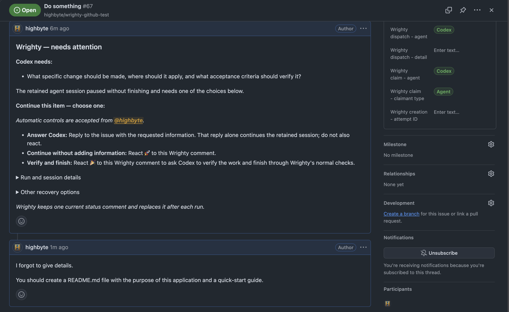

# Autonomous worker mode

`wrighty worker` schedules one explicitly eligible item at a time, claims it with a fenced handle,
starts Claude Code, Codex, or Copilot headlessly, renews the claim for a fixed budget, and records
the workspace and vendor session address. Wrighty is the scheduler; the vendor CLI remains the
agent runtime.

Worker mode runs an unattended agent that executes commands and modifies files on this machine
under the [permission profile](#spawned-agent-permissions) you select. Start with a dry run and one
item. Worktree mode also requires the selected agent's Wrighty skill to be installed at user scope
or committed in the current Git revision; see [Agent skills](agent-skills.md):

```shell
wrighty create --title "Automate this" --body "..." --auto --agent claude
wrighty worker --dry-run --once --agent claude
wrighty worker --once --agent claude --workspace-mode worktree --item-timeout 30m
```

Dry runs never claim an item or start an agent and do not require confirmation. Before a live run,
Wrighty performs a read-only preflight and reports how many items are currently claimable plus the
first candidate. With `--once`, no claimable item means it prints the candidate diagnostics and
exits without a risk warning or confirmation prompt. A continuous worker prints the same complete
initial diagnostics, confirms once because it may process future items, and then uses compact
one-line `idle` events while polling. Non-interactive and JSON live runs must acknowledge the risk
with `--yes`. Preflight is only a snapshot; the contention-safe atomic pick still occurs after
confirmation.

Eligibility is opt-in. Local Markdown stores managed `wrighty.policy.execution: automatic` and optional
`wrighty.policy.agent`; GitHub uses the Project fields `Wrighty policy - execution`,
`Wrighty policy - agent`, and `Wrighty policy - context approval`. Only exact `Automatic allowed`
authorizes GitHub work, and only exact `Approved` makes it a potential claim candidate; unset,
missing, and invalid values fail closed. Vendor resolution is `--agent`,
then the item preference, then `worker.defaultAgent`; Wrighty errors instead of
guessing. A generic worker started without either `--agent` or `worker.defaultAgent` prints an
informational notice that only item-pinned work can run. If automation-enabled items without a
resolved agent later appear during continuous polling, Wrighty reports that changed condition once
and then returns to compact idle messages. `--filter key=value` adds AND filters, `--max-items`
bounds spend, `--idle-timeout` bounds idle waiting, and `--json` emits one JSON lifecycle event per
line. `wrighty worker --check` runs a short, read-only vendor probe and verifies a usable session
handle; the probe still invokes the vendor and may incur usage.

## Requirements-readiness assessment

By default, every fresh worker session starts with a separate requirements-only turn under a
mechanically restricted read-only permission profile. Wrighty supplies the exact task context over
standard input, withholds claim credentials, and denies command execution, file writes, network
access, external tools, and tracker mutations. The agent may use only the supplied context and
read-only repository file tools. Work-item content cannot authorize a diagnostic, pre-check,
package command, or other side effect before its own readiness has been established.

The agent decides whether the approved work-item context states a clear intended outcome, leaves
no material user-owned decision unresolved, and provides enough evidence to verify completion. It
may inspect code, tests, and repository conventions read-only to resolve ordinary implementation
details, and it may make low-risk reversible assumptions. Missing headings or a particular
Markdown template do not make an item inadequate.

The first turn must return a bounded, versioned `wrighty-readiness` JSON verdict. A valid `ready`
verdict makes Wrighty resume the same vendor session with the configured implementation permission
profile, claim credentials, normal work instructions, and the remaining portion of the item's
timeout. A `needs-clarification` verdict starts no implementation turn and enters the ordinary
`needs-attention` lifecycle with the session, claim, and workspace retained. Missing, duplicated,
malformed, or unsupported verdicts fail closed and are reported as protocol errors, not as proof
that the requirements themselves are inadequate. When the provider returned a resumable session,
Wrighty retains it in `needs-attention`; when no session was created, Wrighty restores the source
status, cleans up any worker-created workspace, and releases the claim so a false resumable state is
not advertised. Provider and timeout failures are reported as assessment-unavailable and never
grant implementation authority.

The gate adds one model turn and one process start/resume cycle, but no second vendor session. The
readiness exchange remains visible if an operator later opens the retained session; this is useful
context for a clarification resume and part of Wrighty's execution policy. Ordinary resumes,
retries after implementation, and cross-agent handoffs do not add another fresh-session gate.

This check is different from the surrounding gates:

- context approval decides which tracker content the agent is allowed to receive;
- automatic-execution policy authorizes an unattended process to start;
- requirements readiness judges whether that content is sufficient to begin implementation; and
- `finish` still requires the tracked work and its verification to be genuinely complete.

The repository setting defaults to `enforced`:

```json
{
  "worker": {
    "requirementsAssessment": {
      "mode": "enforced"
    }
  }
}
```

Use `inline` to fall back to the lower-cost single-turn behavioral guard, where the implementation
agent is instructed to assess before acting but Wrighty cannot mechanically prevent an early side
effect. Use `off` only as the operational compatibility escape hatch; it emits one
`requirements-assessment-disabled` warning at startup (or before an explicit fresh-item run).
Ordinary blocker handling, approved-context checks, authorization, claims, and completion rules
remain active in either fallback. Existing sessions keep the prompt they started with.

## Local agent availability

Wrighty distinguishes three states:

- **Supported** means Wrighty has an adapter for the vendor: Claude, Codex, or Copilot.
- **Installed** means that vendor's executable is currently discoverable on this machine.
- **Ready** means the stronger `wrighty worker --check` probe also succeeds.

See [Supported agents and surfaces](supported-agents.md) for how this worker support relates to
skills, interactive resume, Desktop opening, and cross-agent handoff.

Ordinary worker preflight checks installation only; it does not launch an agent or infer
authentication and subscription health. A generic worker skips items whose resolved agent is not
installed, without claiming them, and can continue to later items assigned to an installed agent.
It reports per-agent unavailable counts in human and JSON candidate diagnostics. A long-running
idle worker refreshes discovery, so installing a missing CLI makes newly compatible work eligible
without restarting Wrighty.

Vendor intent is never rewritten. Resolution remains `--agent`, item policy, then
`worker.defaultAgent`, and Wrighty does not fall back to a different installed vendor. An explicit
`--agent`, an exact `--item`, or a recorded session that names an unavailable vendor fails with
`AGENT_NOT_INSTALLED` and identifies the item and resolution source where applicable. When no
supported CLI is installed, a live general worker fails with `NO_AGENT_INSTALLED`; a dry run still
prints diagnostics and never invokes a vendor process.

An unavailable-agent lifecycle event includes the aggregate count and a per-agent map:

```json
{
  "type": "agent-unavailable",
  "candidates": {
    "unavailableAgent": 2,
    "unavailableAgents": {
      "claude": 2
    }
  }
}
```

Executable discovery is a snapshot immediately before admission. If the executable disappears
between that check and process creation, Wrighty reports `AGENT_START_FAILED`, releases the claim,
restores the item's prior dispatch state, and removes a worktree created for that attempted run.

`wrighty init` ensures the Project policy schema and dispatch-state lifecycle labels exist and,
unless `--skip-issue-forms` is selected in the approved initialization plan, scaffolds one neutral
task form. A Project writer reviews the issue, selects Wrighty policy - agent when needed, and changes
Wrighty policy - execution to Automatic allowed. Provider capacity remains a property of the worker machine;
worker preflight still reports a missing or unsupported local vendor executable. Use
`wrighty init --skip-issue-forms` when the repository manages its own issue-template experience.
Interactive initialization asks whether to commit and push forms it changed. Automation must opt in
with `wrighty init --yes --publish-issue-forms`; `--yes` by itself does not publish repository files.
Wrighty's generated chooser configuration disables blank issues for contributors, although GitHub
continues to expose a maintainer-only blank option to users with Write access or above.

## Spawned-agent permissions

Wrighty is the scheduler; the vendor CLI enforces what the spawned agent may do. `worker` requests
one of two configurable vendor-neutral **implementation permission profiles** per agent, and each
adapter maps it onto that vendor's own flags:

| Profile | Intent |
| --- | --- |
| `workspace` (default) | The least privilege that still completes the tracked work: command execution and network stay available, file writes are confined to the workspace wherever the vendor can express it. |
| `full` | The vendor's unrestricted mode. An explicit opt-in, never a silent fallback. |

The enforced requirements gate also uses an internal `read-only` profile. It cannot be selected as
an implementation profile: Wrighty applies it only to the first assessment turn, then switches to
the configured `workspace` or `full` profile after a valid ready verdict.

**Network is part of the least-privilege profile on purpose.** With the GitHub backend the agent
runs its own `wrighty get` and the skill runs `wrighty init --check`, both of which reach the GitHub
API. A sandbox that disables network makes the agent produce no work at all.

Select a profile with `worker.agentPermissions`, and override one vendor with
`worker.agents.<vendor>.permissions` (see [Configuration](configuration.md#worker)). Every live run
prints the *effective* profile per agent before the confirmation prompt, and `--json` runs carry it
on the `started`, `resumed`, and `dry-run` events as a `permissions` object.

### What each vendor actually enforces

Verified on 2026-07-25 with Claude Code 2.1.219, codex-cli 0.145.0, and GitHub Copilot CLI 1.0.75:

| Agent | `workspace` maps to | Confines file writes | Network | Enforcement |
| --- | --- | --- | --- | --- |
| Codex | `--sandbox workspace-write -c sandbox_workspace_write.network_access=true` | yes | yes | enforced |
| Copilot | `--allow-all-tools` | yes (workspace plus the system temporary directory), for shell commands as well as file tools | yes | enforced |
| Claude | `--permission-mode acceptEdits --allowedTools "Bash Edit Write Read Glob Grep NotebookEdit TodoWrite Task"` | **no** | yes | partial |

| Agent | assessment `read-only` maps to | File writes | Commands/network |
| --- | --- | --- | --- |
| Codex | `--sandbox read-only` | denied | network disabled by the sandbox |
| Copilot | deny `write`, `shell`, and `url`; disable built-in MCPs; disallow the temporary directory | denied | denied |
| Claude | `--permission-mode dontAsk --tools "Read Glob Grep"` | mutating tools unavailable | Bash and network tools unavailable |

| Agent | `full` maps to |
| --- | --- |
| Codex | `--sandbox danger-full-access` |
| Copilot | `--allow-all` (all tools, all paths, all URLs) |
| Claude | `--dangerously-skip-permissions` |

**The asymmetry is real and is reported rather than hidden.** Claude Code exposes no verified
headless mode that confines file writes to the workspace: under `acceptEdits` with a tool
allow-list a `-p` run completes without a permission stall and reaches the network, but writes to a
parent directory succeed through both Bash and the `Write` tool, and enabling the CLI's built-in
sandbox through `--settings` did not confine them either. What Claude's `workspace` profile does
deliver is tool-level narrowing: tools outside the allow-list are denied instead of auto-approved.
The live-run warning marks this profile as weaker than requested, so nobody concludes a Claude run
is contained to the worktree.

Copilot separates tool approval (`--allow-all-tools`, documented as required for non-interactive
use) from path and URL access (`--allow-all-paths`, `--allow-all-urls`, both included in
`--allow-all`), so the `workspace` profile keeps tool approval while leaving path verification in
place. Verified end to end: under `--allow-all-tools` a parent-directory write was denied through
both Copilot's file tool and the shell ("Permission denied and could not request permission from
user"), while the identical prompt succeeded once `--allow-all-paths` was added. Copilot applies
path verification to shell commands as well as file tools. Codex was likewise verified end to end:
network reachable, workspace write accepted, parent-directory write denied.

The read-only liveness probe behind `wrighty worker --check` and the provider capacity probe never
carry the configured profile. They only prove the vendor answers and honors a session handle, so
they run with Codex's `read-only` sandbox, Claude's tools disabled entirely, and no Copilot
tool-approval flag.

### When a denial stops the work

A permission denial reaches the operator on both of the paths it can take.

If the agent hits the denial, reports it, and ends its turn — the usual outcome, since the vendor
refuses the individual tool call rather than killing the process — the run ends without
`wrighty finish`. Wrighty retains the resumable claim, marks the item `needs-attention`, and
records the agent's final message as the [run outcome](#captured-run-outcome), so the reason is
visible in `wrighty get`, `wrighty status`, the web item panel, and the GitHub status comment.
The specificity of that reason comes from the agent: the worker prompt instructs it to explain the
blocker, but Wrighty repeats what the agent said rather than diagnosing the denial itself.

If instead the vendor CLI terminates on the permission error, the adapter classifies it as a
`permission-denied` failure. Because re-running cannot clear a permission or configuration
problem, Wrighty stops there: it marks `needs-attention`, posts the status comment, and releases
the claim with that state preserved — it does not return the item to the claimable pool, where the
next poll would spawn the same agent and fail identically. `authentication` and
`billing-unavailable` failures are treated the same way. Retryable capacity failures keep their
separate [deferred-retry](#usage-exhaustion-and-deferred-retry) behavior.

### Choosing `full`

`full` grants the vendor's unrestricted mode: command execution and file access across the whole
machine, under the credentials of the user running the worker. Prefer a `worktree` workspace and
the default `workspace` profile, and treat `full` as a deliberate, per-vendor decision for work
that genuinely needs to reach outside the worktree.

## Launch preflight

Selecting an item and starting a vendor process are not the same moment, and authoritative state
can change in between. Every worker launch therefore passes one internal **launch preflight** with
three ordered stages:

| Stage | When | What it protects |
| --- | --- | --- |
| Pre-claim | While scanning candidates | Avoids claiming work that authoritative Project policy or local agent availability already rules out. |
| Post-claim | After the claim, before the workspace exists | Catches a policy change made between selection and claim, and resolves the effective agent permission profile before anything is created on disk. |
| Pre-spawn | Immediately before the vendor process starts | Catches anything that changed while the workspace and session metadata were being prepared. |

Three built-in checks run today. `worker-policy` re-reads the item and applies the same authoritative
[Project worker policy](../item-metadata/github-backend.md) evaluation the candidate scan used, so an item
can never be admitted by one path under rules the other would refuse; it gates fresh launches only,
because a resume re-enters a session that already exists here and claim ownership is the authority
for that. `agent-permissions` resolves the effective [spawned-agent profile](#spawned-agent-permissions)
and refuses rather than falling back — an unresolvable profile would otherwise decide how much
privilege an unattended agent receives, and it now fails before a worktree is created rather than
at invocation time.

The candidate scan reads the GitHub Project item's context-approval value alongside its other
projected fields. It skips anything except exact `Approved` before claiming, without loading the
issue conversation, and continues to later candidates. This is only a cheap fail-closed filter:
`approved-context` still runs at post-claim and pre-spawn, and asks a different question at each.
Post-claim asks whether there is an approved context at all; it is the expensive read, placed after
the claim so the answer cannot be raced and before a workspace exists so a refusal costs nothing to
unwind. The full check is deliberately absent from pre-claim, where assembling a context for every
candidate the scan considers would pay a conversation read for items about to be rejected far more
cheaply.

Pre-spawn asks whether the context still holds. For a fresh launch it must be the same revision the
post-claim stage admitted. A resume, recovery or retry never runs post-claim — it re-enters an
already-claimed item — so it compares against the context recorded with the session it is resuming,
and admits an unchanged or purely additive one. It also admits a context that changed only outside
what that session was given — a comment it never received being excluded, for instance — since
nothing it holds moved and there is nothing new to hand it.

A change to a supplied entry's **provenance** also refuses an unattended resume, even though no
approved text moved — a renamed repository or a deleted commenter's account leaves every comment
reading the same while changing who it is attributed to and where it can be found. The agent was
told both, so it is reported and left to a person rather than resumed over.

A change that rewrites what the session already saw refuses an **unattended** resume, because nobody
decided the agent should carry on with superseded content and a resumed agent cannot unsee what it
read. It does not refuse a resume a person asked for: naming the item (`worker --item`), or
clarifying a paused session and requeueing it, is that decision. An automatic retry is not — Wrighty
scheduled it. A permitted override emits a `policy-override` event carrying
`CONTEXT_RESUME_SUPERSEDED`, so continuing across a change never looks like nothing having changed.

Consent is inferred from how the run was started, not from whether you knew about the change. Naming
an item you have not looked at recently admits a resume across an edit somebody else made while the
session was paused, and the `policy-override` event is what tells you afterwards. Read it when it
appears; it names what changed.

Such a resume is the one that carries the **whole** approved context again. An ordinary resume sends
only what was newly approved, because what the session already holds is still correct; here it is
not, and a change that rewrote or withdrew earlier text has no delta to express. The agent is told
that the earlier context is superseded by an operator's decision, given the complete current
snapshot under the same fencing as a fresh launch, and asked to report what it had already done that
the withdrawn requirements called for. It is never told to re-read the item from the tracker — that
is the agent self-fetch the launch gate exists to prevent.

A session with no recorded context cannot be resumed at all, including by an operator: accepting a
change requires having been able to read one. Sessions recorded before approved-context support are
in this state and need a fresh session. So are sessions whose context was recorded under an older
revision format: their digest was taken over a different canonical form, so no difference against
the current one can be computed, and an override has nothing to override. Upgrading Wrighty across
such a change therefore ends any session paused at the time — it is reported as
`CONTEXT_MANIFEST_UNAVAILABLE`, and the item is picked up by a fresh session.

Assembling a context is bounded by [`worker.context.*`](configuration.md); exceeding a bound refuses
the launch rather than truncating, because dropping part of an approved task would change the
requirements while leaving the revision digest looking authoritative.

### What an agent is given

An enforced fresh launch sends the restricted first turn the rendered approved context: the trust
boundary, the item's identity and source, the approved title, description and discussion in order,
and the approval instant and revision. It deliberately omits finish, commit, and implementation
instructions. After a ready verdict, the second turn restores those operating instructions without
re-sending the context the same session already holds. Immediately before that permission increase,
Wrighty re-runs pre-spawn admission so a task edit, approval change, or execution-policy withdrawal
during assessment invalidates the verdict.

The agent is not told to read the item, because reading it returns whatever is on the tracker at
that moment — comments nobody approved, edits made after the approval — which is what the launch
gate refused.

The prompt travels on the vendor's standard input, never in its arguments. An argument list is
readable by every process on the machine and is printed in worker events, so an approved context
placed there would be published on every run. Each vendor asks for a piped prompt differently;
Wrighty selects the right form per adapter and passes no prompt flag that would place text on the
command line.

For a backend without an execution-context provider, the enforced gate renders the title and body
already held by the claimed worker directly into the assessment prompt. The `inline` and `off`
fallbacks retain the older bootstrap behavior.

### What Wrighty writes on the item

Wrighty keeps one current status comment on a GitHub issue. It combines what happened, what the
agent reported, what input is needed, the continuation controls, and the less common recovery
commands. The primary answer is visible immediately; run and session diagnostics and recovery
commands are collapsed below it.

The comment is a working note that goes stale, so Wrighty replaces it after each terminal run and
trims it once the item is requeued or archived. The durable session record separately stores the
latest structured run report on both backends. `worker.sessionReportMode` is accepted only for
compatibility with older configurations and no longer creates separate GitHub report comments.

When Wrighty must fall back to the agent's raw final response, it removes the embedded report block
before quoting that response. The structured fields already appear once in the combined comment;
leaving the block in would duplicate them, and its inner fence would also close the surrounding
code block and spill the rest of the comment into raw Markdown.

### Recovering a lost context

A resumed session is expected to still hold the context it was launched with, and every vendor
measured did after eight resume turns. Under sustained window pressure one lost it entirely — but
reported nothing available rather than inventing an answer, which is what makes recovery safe to
offer rather than necessary to guess at.

```shell
wrighty context <item> --revision <digest>
```

It serves that exact revision or nothing. The digest is in the resume prompt, and an agent that has
lost its context is told to run this before doing anything else.

The refusal is the point. An agent cannot ask for a newer approval, an edited description, or
comments nobody has decided on — so this is not the discovery the approval gate prevents, but a
cache miss on content Wrighty already approved and pinned for this run. When the digest no longer
matches, the approved context moved while the run was in flight: the agent is told to stop and
report rather than continue against requirements nobody approved for its session.

Nothing is stored to make this work. The context is read afresh and its digest recomputed, so the
approved bodies are never kept in local state — the same guarantee without retaining the content.

### Reading the current status

The current status comment exists only on GitHub. It carries both the
`<!-- wrighty-handover:v1 -->` marker and a strict `<!-- wrighty-session-report:v1 ... -->`
identity marker for the latest terminal run. Wrighty replaces it after each run and trims it once
the item is requeued, archived, or its workspace is cleaned up, so there is only ever one and it
always describes the latest run.

Its *content* is available everywhere, because the comment is a rendering rather than the source.
`wrighty get <item>` prints the same next-step actions under `Next actions`, and the web console shows
them as buttons on the item. On Local Markdown that is the only form they take — nothing is
published, and `worker.handoverComment` has no effect there.

### Wrighty's own comments are not task content

Wrighty writes claim events and one current status comment to a GitHub issue. Neither is a
requirement, and none reaches an agent as task context. They are recognised by the account Wrighty
posts as: a comment is treated as Wrighty's own only when its author is the login the configured
`gh` credential authenticates as.

This is an identity rather than a permission level, and deliberately the stricter of the two. GitHub
lets a user with write access edit another user's comment without changing its author, so a rule of
"any maintainer's marker counts" would let a marker appended to a maintainer's requirement drop that
requirement from what the agent receives, while it stayed visible to everyone reading the issue.

Two consequences worth knowing:

- **If the login cannot be established** — no credential, a rate-limited lookup, no network —
  nothing is excluded and every marker-bearing comment is decided like ordinary discussion. That
  costs a re-approval; the alternative would hide content from review.
- **A status comment written by a different installation** — another machine, or a colleague's account —
  is not recognised and reads as ordinary discussion, so it blocks a resume until approved. Running
  Wrighty under its own account makes the recognition exact; on a personal account, its comments and
  yours share an author.

Reaction-based context approvals are a separate question and remain unavailable: 🚀 and 🎉 are
operational continuation controls on the current Wrighty status comment, not decisions that include
or exclude task content.

### Continuing a paused item

What the status comment suggests depends on the backend, because the backends differ in a way that
changes the advice rather than only its wording: only GitHub has a discussion to append to.

On **GitHub**, a configured trusted author can reply with the clarification and stop there. After
the short edit debounce, a continuous worker detects that reply, queues the retained session, and
passes the reply as new context. No approval change, command, or reaction is also required.

Do not edit the description: a rewritten description replaces what the paused session already
holds, which is not an addition to it. If the author is not trusted, a context approver must set the
context-approval field to another value and back to `Approved` — both moves — before the reply may
reach the agent. Then start the named item yourself or explicitly queue it for a continuous worker.

Without adding information, a trusted author may instead react 🚀 on the Wrighty status comment.
Reacting 🎉 there asks the retained agent to verify the work and finish through Wrighty's ordinary
checks. Reactions placed on a user's reply are inert.

On **Local Markdown** there is no discussion, so editing the description is the only way to clarify
an item. That supersedes what the session holds, and an unattended worker refuses to resume across
such a change. Naming the item is what carries the operator's judgement, so the clarification and
the run are two steps:

```bash
wrighty edit <item> --takeover --yes --body-file requirements.md
```

```bash
wrighty worker --item <item> --yes
```

The run proceeds despite the change and reports that it did. Combining the two — editing the
description *and* queueing it for a continuous worker — asks for a resume that is certain to be
refused.

### Reading a run report

Every terminal run stores its report on the item's durable session record on both backends. This is
independent of GitHub comment visibility and the legacy `worker.sessionReportMode` setting.

**From the CLI.** `wrighty get <item>` shows it under `Last run`, after the observed outcome:

```shell
wrighty get local:7
wrighty get github:owner/repo#42 --json
```

The JSON form carries it at `result.session.lastRun.agentReport`. In both forms the final message is
printed with the report block removed, because the same account is already rendered beside it as
fields.

**From the web console.** `wrighty web` shows it in the item's last-run block. Local Markdown
only — the board does not serve GitHub items.

**From GitHub.** The single current Wrighty status comment includes the latest report. Its hidden
identity marker lets Wrighty prove that reactions belong to the current waiting run without showing
a second comment. A trusted reply alone resumes with that reply as context; no reaction is also
needed. A trusted 🚀 on the Wrighty comment resumes without adding information. A trusted 🎉 on the
Wrighty comment asks the agent to verify the work and finish through Wrighty's ordinary checks. A
reaction on the user's reply does nothing. The comment names the accepted trigger, actor, and
content-free consumption key after the resulting run.

Only the most recent run's report is kept locally: the session record holds one and replaces it on
the next run. The GitHub comment likewise presents the current state rather than a per-run history.

Wherever it appears, the report is the agent's own account and is labelled as such. The outcome
beside it is what Wrighty observed, and nothing an agent reports can change it — including a
verification line, which is a claim about a check rather than evidence one ran.

### Hidden comments stop a launch

Hiding a comment on GitHub is the one gesture the interface offers for "this should not count", and
it is the one Wrighty cannot act on. GitHub advances no timestamp when a comment is minimized and
raises no timeline event, so there is nothing to place the hide against an approval.

Both readings would be wrong:

- **Honouring it** would let anyone who can hide a comment remove approved content from a later
  prompt, with no signal Wrighty could detect afterwards.
- **Ignoring it** ships the comment anyway — including the case that makes this matter, where a
  maintainer hides a drive-by injection as spam and then approves the item.

So a hidden comment refuses the launch with `CONTEXT_COMMENT_HIDDEN`, naming the comment, and the
remedy is yours, and the two are not interchangeable: **delete it** if it should not exist, or
**unhide it** and let the approval decide it like any other comment. Unhiding spam that the current
approval already covers will include it — deleting is the answer there. A configured
`github.contextApprovers` member can instead make an explicit, timestamped decision: `+1` includes
that comment revision and `-1` excludes it. Editing the comment afterwards invalidates that
decision.

### Inspecting an approved context

`wrighty context <item>` reports what a launch would be given, or the reason there is nothing to
give. It is read-only: it never claims, launches, or mutates, and it does not print the approved text
— the digest, the approval source and instants, the decision counts, and the limits in force.

```shell
wrighty context github:owner/repo#42
wrighty context local:7 --json
wrighty context github:owner/repo#42 --prompt
```

`--prompt` prints the prompt a fresh launch would give an agent, in full — the trust boundary, the
approved title, description and discussion, and the finishing rules. It is the one place the
approved content is printed, because an operator asking to read what an agent will be told is a
different act from the routine summary that lands in terminals and logs. A refused context prints
the ordinary summary instead: there is no prompt to show for a run that would not start.

The approval source distinguishes where the approval came from: `project-field` for a GitHub Project
field a maintainer set, and `backend-local` for a store that approves its own content. A Local
Markdown store is machine-local and edited directly by its operator, so an item's own title and body
*are* the approved content and there is no separate gesture; its discussion is always empty, because
a store with no comments has none to approve. That also means editing a local item is the only way to
clarify one, which is why an operator-requested resume is allowed to carry such an edit.

When a stage refuses, the worker restores the source status (fresh launches only — a refused resume
leaves an already-active item alone), removes any workspace **this** launch created, releases the
claim, and emits a `skipped-policy` event naming the stage, the check, and its code. A retained
workspace the launch did not create is never a cleanup target, and a dirty worktree is never
force-removed.

What the item comes out as depends on what the launch was. A refused **fresh** launch goes back to
the claimable pool unchanged, so resolving the refusal is the only thing an operator has to do. A
refused re-entry of a **recorded session** — a queued resume, a scheduled retry — is marked
needs-attention instead: something put that run in motion, the refusal is unresolved and needs a
person, and leaving the item queued would refuse again on every poll while dropping it to idle
would hide both the refusal and the actions for acting on it.

## Terminal color and machine output

Human worker output uses semantic color on event prefixes when `--color auto` (the default) detects
that the individual output stream is an interactive, ANSI-capable terminal. Standard output and
standard error are detected independently. Redirected output and writers without declared terminal
capability remain plain text.

Use `--color never` for durable human-readable logs, or `--color always` when an explicit consumer
such as `less -R` should receive ANSI sequences:

```shell
wrighty worker --yes --color never >worker.log 2>&1 &
wrighty worker --yes --color always | less -R
```

In automatic mode, the presence of `NO_COLOR` or `TERM=dumb` disables color. Explicit
`--color always` or `--color never` overrides those automatic checks. `--color always`
deliberately writes ANSI sequences even when human output is redirected.

`--json` always wins over color selection: every standard-output line remains unstyled JSON under
`--color auto`, `always`, and `never`. A background NDJSON worker can be started safely with:

```shell
wrighty worker --yes --json >>worker.ndjson 2>>worker-errors.log &
```

Color changes only the trusted event or warning prefix and resets immediately. Event names and
all existing text remain present, while paths, arguments, messages, session IDs, and operator
commands are never wrapped in styling. Color selection does not affect confirmation or `--yes`.

Worker dispatch state is separate from workflow status and eligibility. Wrighty manages
`wrighty.dispatch.state` locally and `wrighty:dispatch-state=<state>` on GitHub; operators should use
the CLI or web controls rather than edit it directly:

| State | Meaning | Continuous-worker behavior |
| --- | --- | --- |
| absent | Ordinary item | Eligible from the configured pick-from status (`Worker queue` by default) when automatic execution is allowed. |
| `needs-attention` | A vendor session stopped for clarification or another operator decision | Shown prominently, but never retried automatically. |
| `queued` | Clarification is saved and the recorded session is ready to continue | Resumed before fresh work from the configured pick-from status. |
| `retry-scheduled` | The recorded vendor session is parked until a bounded retry time | Ignored before `notBefore`; when due, reacquired under a new claim generation and resumed before fresh work from the configured pick-from status. |
| `handoff-queued` | The work is waiting to continue under a different agent in the same retained workspace | Ignored before `notBefore`; when due, reacquired and launched as a *new* session under the target agent rather than resuming the source session. |

Wrighty policy - execution remains the durable permission for unattended execution. Queuing is a deliberate
one-time dispatch decision; it does not require toggling automation off and back on.

## Model and reasoning effort

A fresh launch can carry an explicit model and reasoning effort, chosen through a stable profile
name rather than a vendor model identifier. With nothing configured the built-in `economy`,
`balanced` and `deep` tiers set effort only — `low`, `medium`, `high` — and leave the model to each
vendor CLI's own configuration.

Precedence is `wrighty worker --profile`, then the item's profile, then
`worker.defaultExecutionProfile`. Resolution fails closed: an unavailable profile is
`AGENT_PROFILE_UNAVAILABLE`, never a quiet fall back to a different tier in either direction.

Only fresh launches carry a selection. A resumed session keeps the model and effort it started with,
so `--profile` with `--resume` is refused rather than ignored, and a same-agent retry reuses the
recorded selection. A cross-agent handoff is a new session and resolves the profile again.

Effort support is a property of the model, not the vendor, and cannot be checked in advance. When a
vendor reports that its model accepts no reasoning effort, the worker emits `effort-unsupported`,
relaunches once without the effort argument, and records the run as having none. Only that specific
refusal is retried; unrecognized levels, entitlement failures, and exhausted quotas still fail.

Full detail, including per-vendor effort levels and how to pin a model:
[Execution profiles](execution-profiles.md).

## Usage exhaustion and deferred retry

[Usage recovery and agent handoff](usage-recovery-and-agent-handoff.md) is the authority for how
Wrighty classifies provider failures and recovers from them. In short: adapters distinguish
retryable usage exhaustion and rate limiting from every other failure kind; a retryable failure
preserves the vendor session and workspace, writes `retry-scheduled`, releases the claim, and
schedules the retry (provider reset > `Retry-After` > exponential fallback, with grace and
deterministic jitter); and the first capacity failure also opens a per-installation provider
circuit that automatic selection respects until a single leased probe closes it. This section
covers the worker mechanics around that behavior.

Continuous workers skip future retries and providers behind an open circuit.
`wrighty worker --item ID --yes` is the explicit timer/circuit override when an operator
intentionally wants to process that item now. To test provider capacity without claiming or
changing an item, run:

```shell
wrighty provider probe copilot
wrighty provider probe copilot --yes --json
```

The probe's semantics — the lease that stops concurrent probes, the confirmation rules, and how
each result kind affects the circuit — are in
[the provider circuit](usage-recovery-and-agent-handoff.md#the-provider-circuit).

`provider-probe-started`, `provider-available`, and `provider-unavailable` worker events explain the
result, while candidate diagnostics explain automatic circuit filtering. `wrighty list` shows the compact retry time,
`wrighty get` shows the sanitized reason, local and UTC timestamps, attempt count, and installation
ownership, and `wrighty status` groups scheduled retries and open provider circuits. The web
console shows the same categorical retry badge and detail callout, plus an
installation-local **Provider capacity** header control immediately before the connection
indicator. Its summary reports active probes and unavailable providers; an anchored popover uses
one compact row per configured agent for current status, known time, sanitized reason, and probe
action without consuming board height. Its **Probe all** action checks every configured provider
concurrently, with one bounded vendor request per provider. Otherwise-ready cards assigned to an
unavailable provider say that the provider is unavailable instead of claiming they are immediately
runnable; their item panel explains that automatic workers will leave them unclaimed and shows the
explicit item-run override. Provider opening, probe leasing, and closure participate in the board
and header-fragment refresh revisions, so both update without an item-file change. The popover can
probe any configured agent even when no circuit is open; affected-item actions offer the same check
in context. Another installation can see the portable
`retry-scheduled` state but cannot invent the machine-local timer or resume address; it reports that
details are unavailable. Provider capacity is keyed by installation and normalized agent;
an account scope is intentionally omitted until a supported CLI exposes a stable non-secret key.

On GitHub, the `wrighty:dispatch-state=retry-scheduled` issue label is the authoritative categorical
state. Projects initialized with the current schema also receive display-only
`Wrighty dispatch - state`, `Wrighty dispatch - not before`, `Wrighty dispatch - agent`, and
`Wrighty dispatch - detail` fields. Projection failure does not affect the label or
installation-local schedule. Provider capacity is not GitHub authority and is not copied into
Project fields.

In the web console, claiming a scheduled item for editing does not silently cancel its
timer. Ordinary **Save**, **Release without saving**, and **Save and release** actions preserve the
scheduled retry while allowing instructions to be clarified. The agent-policy selector is
locked because the retry belongs to the recorded vendor session; changing vendors requires an
explicit cross-agent handoff rather than changing `wrighty.policy.agent`. Turning off execution policy
or moving the item out of the active worker status cancels the schedule. **Save and resume
automatically** deliberately overrides the timer and queues the recorded session now, while
handback, finish, and archive actions also clear the obsolete deferred-dispatch record.

`worker.usageFailure` configures the recovery action, retry timing, attempt caps, and cross-agent
handoff; the full schema, defaults, and semantics are in
[Configuration](usage-recovery-and-agent-handoff.md#configuration). A handoff is a **new** session
by the target agent in the same retained workspace, seeded with a bounded, redacted handoff
packet; the old vendor session is not resumed or converted and stays independently reviewable on
the recording host, and the item's agent policy field is updated to the target (see
[cross-agent handoff](usage-recovery-and-agent-handoff.md#cross-agent-handoff)). Total automatic
recovery is bounded: retries consume `maxAttempts`, and handoffs may add at most the configured
fallback count on top before the item moves to `needs-attention`.

To demonstrate these paths against an installed Wrighty without changing an agent or provider,
open **Web console → Settings → Repository → Advanced/testing**. Per-agent availability can be
changed to **Pretend not installed**, while a selected implementation result enters the normal item
recovery policy, including dispatch persistence, GitHub presentation, retry timing, and cross-agent
handoff. Synthetic usage failures do not open the installation-wide provider-capacity circuit.
Turn the source agent's simulation off before a same-agent retry that should succeed; leave the
target agent off for a handoff demonstration. Synthetic implementation results leave
requirements-readiness turns and diagnostic checks real; availability simulation deliberately
affects installation-dependent checks. Repository simulations stay enabled until explicitly
turned off.

The Local Markdown web editor exposes these managed values as **Allow automatic execution**
and **Agent policy**. If no item can be claimed, the worker reports how many active items it
considered in the source status, how many are manual-only or lack an item-level agent policy,
how many have an unapproved projected context, how many filters excluded, how many cannot resolve a
supported agent, and how many otherwise eligible items were unavailable because of an active claim
or claim contention.

Preassigned Claude and Copilot handles are stable for one claim generation but change when an item
is acquired again; deliberate continuation uses the session ID recorded on the active claim.

Workspace handling is a worker setting, not a work-item field. Resolution is the explicit
`--workspace-mode` option, then `worker.workspaceMode` in `.wrighty.json`, then `current`:

| Mode | Directory | Concurrency behavior |
| --- | --- | --- |
| `current` (default) | Current repository checkout | Takes an exclusive Wrighty worker lock. A second worker targeting the same canonical directory gets `WORKSPACE_BUSY` before it claims an item or starts an agent. |
| `shared` | Current repository checkout | Explicitly disables the worker lock. Multiple workers may run there concurrently. Wrighty warns because it cannot detect or resolve file, staging, build, or commit conflicts. |
| `worktree` | Fresh directory under the configured `worker.worktreeRoot` (default `<repo>.worktrees` beside the repository) | Gives each item an isolated branch and checkout. Recommended for unattended or concurrent workers. |

`shared` is an unsafe opt-out for an operator who accepts responsibility for coordinating the
items. Agents may not recognize that a changed or staged file belongs to another concurrent agent.
Select it explicitly for one invocation, or deliberately make it the repository default:

```shell
wrighty worker --workspace-mode shared --yes
```

```json
{
  "worker": {
    "workspaceMode": "shared"
  }
}
```

Every live run resolved to `shared` prints the additional collision warning, including runs using
the configured default.

## Branches, worktrees, and the workspace lifecycle

Wrighty creates a git branch **only in `worktree` mode**: each processed item gets a fresh
worktree and a dedicated branch, both created with
`git worktree add -b wrighty-worker/<item>-<unique> <path> HEAD`. In `current` and `shared`
modes the agent works directly on whatever branch is checked out and Wrighty creates nothing.
The branch name is recorded in the machine-local session record: `wrighty get <id>` shows it,
the `finished` output prints it, and it survives claim release and expiry.

### Location and naming

Three worker settings control where worktrees live and how they are named:

| Setting | Default | Placeholders |
| --- | --- | --- |
| `worker.worktreeRoot` | `{repoParent}/{repo}.worktrees` | `{repo}`, `{repoParent}`, `{home}`, `{repoPathHash}` |
| `worker.branchFormat` | `wrighty-worker/{id}-{title}` | `{id}`, `{number}`, `{title}`, `{unique}`, `{agent}`, `{date}` |
| `worker.worktreeNameFormat` | `{id}-{title}` | same as `branchFormat` |

`{id}` is the full item slug (`local-22`, `github-owner-repo-42`); `{number}` is the bare item
number (`22`, `42`); `{title}` is a slug of the item title truncated to 30 characters;
`{unique}` is an 8-character per-acquisition fragment; `{repoPathHash}` disambiguates
same-named repositories under a shared root such as `{home}/.wrighty/worktrees`. A CI-friendly
convention like `branchFormat: "feature/{number}-{title}"` makes the push-PR completion path
rename-free.

Every expansion is sanitized to a valid git ref or directory name and capped in length.
Uniqueness is guaranteed regardless of format: when the format omits `{unique}` and the branch
or path already exists — retained worktrees from earlier runs are a normal state — Wrighty
appends the unique fragment instead of failing. Keeping worktrees inside the repository
(`{repo}/...`) is discouraged: nested worktrees are picked up by IDE indexers and build globs,
and `git clean -xdf` in the main checkout can destroy active agent work.

The branch exists from spawn time, but it only *contains* the work once something is committed
inside the worktree. Until the first commit, the branch still points at the spawn-time base
commit and the worktree's working directory holds the only copy of the changes.

### Commit policy

`worker.completion.commit` decides who commits, and the worker prompt instructs the agent
explicitly in both directions so the outcome never depends on vendor-agent habit:

| Value | Behavior |
| --- | --- |
| `inspect` (default) | The agent is told to leave every change uncommitted. The worktree is always retained as your review queue, and the finished output says so. Until you commit, the working directory is the only copy of the work. |
| `agent` | The agent is told to commit its work in logical commits referencing the item. A clean worktree is then removed on finish while the branch keeps the work; pass `--keep-workspace` to retain it anyway. |

In `current` and `shared` modes the commit instruction is never added: Wrighty does not direct
commits on the operator's own checkout.

`agent` mode depends on the vendor agent's environment actually permitting an unattended commit.
Wrighty's prompt asks for the commit, but it deliberately cannot override the agent's own
governance — a global "do not commit unless I ask" instruction, a restrictive permission mode, or
a sandbox that blocks `git commit` will all veto it. When that happens the agent leaves the change
uncommitted, git's dirty-tree guard retains the worktree, and the item safely lands in
`needs-attention` rather than being reported done. This is the intended fallback, not a failure:
the work is never lost, and you can commit it yourself or rerun with commits permitted. If you
routinely disallow unattended commits, prefer the default `inspect` policy.

### Completing a finished item

Wrighty deliberately never merges, pushes, or opens PRs. `worker.completion.integration`
(`none` default, `merge-local`, or `push-pr`) selects which guidance the finished output and the
agent skill render; execution stays with you. Because main is checked out in your primary
working copy, git will not let the worktree commit onto it directly — the flow is always
commit on the worker branch, then integrate from the main checkout:

```shell
# inspect policy: commit first, inside the worktree
cd ../myrepo.worktrees/local-22-validate-user-names && git add -A && git commit

# merge-local, from the main checkout (remove the worktree before deleting its branch)
git merge --ff-only wrighty-worker/local-22-validate-user-names
git worktree remove ../myrepo.worktrees/local-22-validate-user-names
git branch -d wrighty-worker/local-22-validate-user-names

# or push-pr, from any checkout
git push -u origin wrighty-worker/local-22-validate-user-names
```

Archive the item as the last step, from the web console or with `wrighty archive` while
holding a claim; `archive.onStatuses` automates this at finish for fire-and-forget setups.

### Retained workspaces

Retained worktrees and worker branches accumulate by design: inspect-first runs, failed runs,
and merged-but-unremoved workspaces are all normal states. Two commands surface and clear them:

```shell
wrighty workspaces                    # list retained worktrees: dirty/clean, merged/unmerged, item
wrighty workspaces cleanup <id>       # remove the item's worktree and delete its merged branch
wrighty workspaces cleanup <id> --force  # discard uncommitted changes and unmerged commits too
```

The two status tokens are **orthogonal** — they measure different things:

- **`dirty` / `clean`** describes the *working tree* (`git status`): are there uncommitted
  changes in the worktree?
- **`merged` / `unmerged`** describes the *commit graph* (`git merge-base --is-ancestor <branch>
  HEAD`): are the branch's own commits already contained in the main checkout's HEAD? A branch
  with no commits of its own is trivially "merged".

Because they are independent, each workflow leaves a characteristic signature, and the completion
flow moves the worktree through them:

| After… | State | Why |
| --- | --- | --- |
| an `inspect` run | `[dirty, merged]` | the agent left the work uncommitted (dirty), so the branch still points at the spawn-time base commit and has nothing beyond HEAD (merged). This is the normal resting state, not a contradiction. |
| committing in the worktree | `[clean, unmerged]` | the work is now committed on the branch (clean tree) but not yet in main (unmerged). |
| `merge-local` / integrating and removing | (drops off the list) | the branch is merged into the main checkout and the worktree removed. |

Cleanup delegates every safety decision to git: a dirty worktree is refused
(`WORKSPACE_NOT_CLEAN`) and an unmerged branch is refused (`WORKSPACE_BRANCH_UNMERGED`); by default
Wrighty never forces either. This is why an `inspect` worktree (`[dirty, merged]`) is refused on
the worktree-remove step — the uncommitted work is protected — while its branch would delete
cleanly if the tree were clean.

`--force` overrides those two git refusals — `git worktree remove --force` and `git branch -D` —
**discarding uncommitted changes and unmerged commits**. Use it only when you know the leftover
files are disposable (for example, tool artifacts such as `.memsearch/`); for anything recurring,
prefer `.gitignore`, since ignored files never block a normal cleanup. `--force` deliberately does
**not** override an active claim: an item whose claim is still held always reports `CLAIM_HELD`,
because forcing there could pull a workspace out from under a live worker or editor. Both commands
support `--json`.

`wrighty get <id>` and the web item viewer show the same working-tree and branch state for the
one item, calculated on demand from git on the machine that holds the worktree. When the recorded
worktree is not present on the current host (or git cannot be read), the state is reported as
unavailable rather than guessed — the recorded branch and path are still shown.

### Reviewing the session

After an item is genuinely finished, Wrighty prints a `review:` command that opens the completed
vendor session interactively when its workspace still exists, plus a suggested completion prompt
that asks the agent to walk the diff, propose a commit, integrate, clean up, and archive with
your approval. The `finished:` line uses the agent's short structured report summary when present;
the fuller closing explanation and report fields remain available in the saved run and session.
Older agents without a usable summary retain their closing prose on that line. The review command
invokes the vendor directly, carries no Wrighty claimant ID or token, and does not reacquire the
completed item. It is always available in `current` and
`shared` modes while the checkout exists; under the `inspect` commit policy the worktree is
retained too. With `commit: agent`, use `--keep-workspace` to retain a clean successful worktree
for later review:

```shell
wrighty worker --once --workspace-mode worktree --keep-workspace
# finished: ...
#   branch: wrighty-worker/local-22-validate-user-names
#   review: cd '...' && claude --resume '...'
```

Wrighty passes the absolute original tracker configuration path to the child agent as
`WRIGHTY_CONFIG_PATH`. Consequently, Local Markdown `get`, mutation, renewal, and finish
commands operate on the authoritative original store rather than a stale copy checked out in
the agent worktree.

Renewal occurs at lease half-life and has a fixed spawn-time budget equal to `--item-timeout`. It
can never renew past that deadline, so the maximum hold after a hung run is
`--item-timeout + leaseMinutes`. On `CLAIM_STALE` or `CLAIM_EXPIRED`, the default
`--on-fenced kill` stops the process tree. `detach` is available for deliberate operator use, but a
detached process can keep editing files and is unsafe in a shared checkout.

While a vendor process is running, the worker emits a single-line operational heartbeat every five
minutes. It reports elapsed time, the current claim-expiry time, remaining fixed timeout budget,
and workspace mode:

```text
2026-07-19T14:20:00.0000000+00:00 running: local:22 [claude] — 20m elapsed; claim valid until 2026-07-19T15:00:00.0000000+00:00; timeout in 40m; workspace worktree
```

This is intentionally process-level visibility rather than an agent transcript. Wrighty does not
stream model responses, tool calls, or reasoning, and the optional web console does not become an
agent frontend. In another terminal, use `wrighty get <id>` to inspect the durable claim, session,
workspace, and lease state. When the worker runs under a service or with redirected output, ordinary
process logs retain the same heartbeat and lifecycle lines.

Vendor process success is not item completion. An item is `finished` only when the agent calls
`wrighty finish` and the configured completion state is observed. If a successful agent turn exits
while its exact claim remains active, the worker emits `needs-attention`, leaves the item
`In Progress`, sets its dispatch state to `needs-attention`, stops renewing, and retains the
session/workspace claim until its finite lease expires. A continuous worker does not retry that
state automatically. `--once` returns exit code 10 for this outcome.

The `needs-attention` footer is organized by what the operator wants to do. In `wrighty web`, choose
**Queue for worker** directly when fixing an external permission or configuration problem requires
no work-item edit. Wrighty ends the retained same-installation claim and marks the recorded session
queued, including after that claim expires. When the requirements need clarification, choose **Take
over for editing** while its claim is active or **Claim for editing** after expiry, edit the title or
body, then choose **Save and resume automatically**. To continue the session yourself instead,
open **More actions…** and choose **Save and show manual <agent> resume command**. Choose
**Finish** when the tracked work is already complete. To close the item without further agent work,
save it and choose
**Archive** from the item view. The web claim path preserves a complete local recorded session
across expiry.

The CLI equivalent is atomic and does not require copying claim environment variables:

```shell
wrighty edit <id> --takeover --yes --body-file requirements.md --requeue
```

`--requeue` requires a complete recorded agent/session/workspace address. It clears active human
ownership, rotates the terminal fencing generation, and marks the session `queued`. A normal
continuous `wrighty worker` scans queued `In Progress` items before fresh candidates from the
configured pick-from status (`Worker queue` by default) and resumes the recorded vendor session.
`wrighty requeue <id>` is available when the caller already holds and supplies the exact claim
handle.

After saving the clarification, continue headlessly with:

```shell
wrighty worker --item <id> --yes
```

That command works both while the current claim is active and after it expires. Wrighty infers
whether to take over the active local session, recover an expired session under a new claim
generation, or start a new session when no recorded address exists. Claim expiry invalidates
authorization, not the vendor's durable session; an expired token is never revived or reused.
Automatic recovery is limited to the installation that created the session, where its recorded
workspace and vendor state are meaningful. Another installation must use `--fresh` explicitly
after expiry.

For CLI editing while the current claim is still active, use either the interactive editor or
direct edit options:

```shell
wrighty edit <id> --takeover
wrighty edit <id> --takeover --yes --title "Clear title" --body-file requirements.md
```

The first command prompts before displacing an active claimant; the scripted example uses `--yes`.
Both also work after expiry, acquiring a new human editing claim without a takeover prompt while
preserving a recoverable local session. They apply the edit with the resulting handle inside one
Wrighty process, retain human ownership, and print the headless continuation command. No environment
variables need to be copied.

`--item <id>` processes exactly that item and chooses from claim state: an active same-installation
session is taken over and resumed; an expired session is reacquired under a new claim and resumed;
an item with no recorded session starts new. It never takes over another installation's active
claim, and it refuses to silently discard an incomplete or missing-workspace session address.
Use Boolean intent assertions when inference is not desired:

```shell
wrighty worker --item <id> --resume            # require a recoverable existing session
wrighty worker --item <id> --fresh             # require an unclaimed item and start a new session
wrighty worker --item <id> --handoff           # hand the recorded work to a fallback agent
wrighty worker --item <id> --handoff --agent codex   # hand it to a named agent
```

`--handoff` is the operator's "switch target agent" action: it requires a complete recorded
session on this installation, and starts a **new** session by a *different* agent in the same
retained workspace, launched with the bounded handoff packet as supplementary context — exactly
what the automatic usage-failure handoff does, but on demand. An ended session's retained claim
(the lease a needs-attention ending keeps so the session stays resumable) is superseded: the
worker takes it over, fences the ended claimant, and proceeds; only another installation's claim
refuses the handoff. The explicit
command is the consent, so it needs no `allowCrossAgentHandoff` opt-in; without `--agent` the
first supported, installed, circuit-closed entry in `usageFailure.fallbacks` for the recorded
agent is chosen. The recorded session is not resumed or converted and stays reviewable; like
every handoff, the item's agent policy field is updated to the target agent so the board names
the agent now responsible (see
[cross-agent handoff](usage-recovery-and-agent-handoff.md#cross-agent-handoff)).

`--resume`, `--fresh`, and `--handoff` are mutually exclusive and fail when current state does not
match the requested intent. Fresh starts still require normal execution policy and accept the
configured source or active status. Add `--dry-run` to print the inferred or asserted action
without claiming, taking over, or spawning.

### The agent policy field directs handovers

The item-level agent policy field (`Wrighty policy - agent` on the GitHub Project, **Agent** in
the web console's editor) is also the board-native handover control: setting it to a different
vendor than the item's recorded session directs the next worker scan to hand the work off there,
and every handoff writes the field back to the target. The full semantics — what directs a
handover, what every handoff writes, and how `worker.defaultAgent` differs from a direction — are
in [cross-agent handoff](usage-recovery-and-agent-handoff.md#cross-agent-handoff).

For takeover, run:

```shell
wrighty takeover <id> --yes --print-resume-command
```

This rotates the fencing token and preserves the recorded vendor session/workspace address. With
`--print-resume-command`, an agent takeover prints both interactive and headless-worker alternatives;
a human takeover prints the safe headless-worker continuation. The separate
`wrighty resume-command <id>` prints only the recorded interactive vendor address without rotating
the claim; it reads the durable session record, so it also works after the item is finished or the
claim released — which is how you reopen a completed session for guided completion. It prints a
command you run in your shell; add `--exec` to launch the structured vendor invocation directly in
the current terminal instead of copying and re-running the printed command. The executable,
arguments, working directory, and environment are passed independently rather than through
`$SHELL -c`. Once the session is open, paste the
guided-completion prompt Wrighty prints (a separate copy block) to have the agent summarize the
diff, commit, integrate, clean up, and archive with your approval at each step. Takeover is
limited to the same Wrighty installation. A worker elsewhere cannot be
seized on demand; wait at most
`--item-timeout + leaseMinutes` for expiry or coordinate with that installation.

The web UI provides the equivalent flow: **Take over for editing**, clarify, then choose **Save and
resume automatically** for continuation by a continuous worker. To continue it yourself, open
**More actions…** and choose **Save and show manual _Agent_ resume command**. The manual action
rotates the claim to a fresh agent claimant and displays the environment-prefixed interactive
command plus the headless alternative. On macOS or native Windows, that agent-owned view can also
**Open _Agent_ CLI** in a new Apple Terminal or Windows Terminal window. Plain **Save** keeps human
ownership, displays only the headless command, and—when the vendor has a qualified deep link and
its app is installed—can **Open _Agent_ Desktop** under the retained human claim. Desktop does not
receive Wrighty's fencing environment: stop or idle it before handing the session back. For an
interactive continuation, enter the adjacent vendor-specific follow-up prompt to explicitly load
the Wrighty skill, re-read the clarified item, and continue.
Release ends ownership without discarding recovery state: the recorded session/workspace address
is a durable machine-local record that survives release and expiry, so a released item can still
be resumed later with `wrighty worker --item <id>` on the installation that recorded the session.

## Captured run outcome

When a run ends — `finished`, `needs-attention`, `failed`, `timed-out`, or `rejected` — Wrighty
records the outcome (`succeeded` / `failed` / `rejected`), the agent's final message or block
reason (truncated), and the end time onto the durable session record.

**The item's outcome and the session's ending condition are separate.** An agent can call
`wrighty finish` and then have its own session end badly — hitting a usage limit immediately
afterwards, for example. Because the tracked work landed, the run reports `finished` and the
recorded outcome is `succeeded`; the vendor failure stays attached to the run so the capacity or
error condition is still visible. Wrighty does not schedule recovery for such a run: the agent
released its claim when it finished, and the item is not waiting on anything. This is **backend-neutral**
and overwrite-only: it survives release, expiry, takeover, and archive, exactly like the recorded
session address. It surfaces as a **Last run** block in `wrighty get` (human and `--json`), in the
web item panel above the resume/requeue actions, and in `wrighty status`. This makes the local
clarify → requeue loop self-contained: read the block reason in the web UI or `wrighty get`, edit
the description, and requeue — without opening the vendor session first.

The captured outcome also distinguishes a **completed** item from a **paused** one. An unclaimed
item whose recorded session succeeded and whose status reached the configured finish state
(`defaultFinishTo`) reports operational status `completed` — the work landed; its primary next action
is finalize/archive, not resume. An item whose session is merely retained for later resumption
reports `paused-session`. Both keep the durable resume address; only the presentation differs, and
a `completed` item can still be reopened deliberately if its worktree is present. (The
*resumability* half is separate: `wrighty get`'s `resumableHere` is `false` and
`wrighty resume-command` refuses with `RESUME_WORKTREE_ABSENT` once the recorded worktree directory
is gone.)

## Discovering what needs attention (`wrighty status`)

`wrighty status` is the machine-side "what needs me?" surface and the CLI counterpart to the web
console. It groups active items by the operator's next action:

```shell
wrighty status          # human-readable, grouped
wrighty status --json   # same groups for scripting
```

- **Needs attention** — blocked items, each with the last-run outcome and final-message excerpt and
  the clarify → requeue / continue commands.
- **Completed — retained worktree** — finished items whose worktree is still present, each with the
  branch, its `dirty`/`merged` git state, and the integration commands for the configured policy.
- **Paused — resumable session** — retained sessions waiting to be resumed, with the resume command.
- **Active** — items with a live claim (agent processing, human editing, automation).
- **Resume queued** — items marked to be resumed by a continuous worker.
- **Retry scheduled** — retained sessions waiting for their bounded retry time.
- **Handoff queued** — retained workspaces waiting for a due cross-agent continuation by the
  recorded target agent.
- **Provider unavailable** — installation-local provider circuits, including whether automatic
  work is paused or another worker owns the single due capacity probe. Use
  `wrighty provider probe AGENT` to test it immediately without selecting a work item.
- **Local worker processes** — one installation-local heartbeat record per worker invocation,
  including PID, verified/stale/unknown liveness, current item, startup configuration revision, and
  a sanitized invocation summary. The web console orders Running, then Unknown, then Stale workers,
  with the most recent heartbeat first within each group, and visually de-emphasizes stale rows.

Stopping a worker with Ctrl-C (or `SIGTERM`) requests a graceful shutdown: the loop unwinds, its
cleanup runs, the instance record above is removed, and the process exits with the conventional
interrupted code. A second Ctrl-C stops waiting and forces the exit. A worker that was killed
outright — or crashed — leaves its record behind on purpose: that is what the stale liveness state
detects, and the record expires a day after its last heartbeat.

A worker process, a tracker claim, an agent process, and a retained session are four different
facts. An idle continuous worker can be live with no claim. A crashed worker can leave a valid
claim until its lease expires. The agent subprocess may exit while its fenced claim and resume
address remain deliberately retained. Wrighty therefore never derives local process liveness from
a claim.

Live workers heartbeat every 15 seconds in the machine-local cache and become stale after 45
seconds without a heartbeat. Wrighty also compares the PID's process-start identity to prevent PID
reuse from appearing live. Platforms that cannot verify that identity report `unknown`, not
`running`. Normal exit removes the record; stale cleanup never releases or changes a tracker claim.
When the recorded process no longer exists, that direct observation is reported even if its last
heartbeat is also old.
When a worker's startup configuration revision differs from the current `.wrighty.json`, human
and JSON status output reports configuration drift and the need to restart that worker.

The retained-worktree git state is calculated on demand, bounded and timeout-guarded, only for the
items in the first three groups and only on the machine that holds the worktree (it degrades to
"unavailable" off-host) — the same posture as `wrighty workspaces`. The at-a-glance
`[worktree]` marker in `wrighty list` (and the board badge in the web console) flags which items
have a retained worktree without any git call; drill into `wrighty get`, the web item viewer, or
`wrighty workspaces` for the per-item `dirty`/`merged` detail.

## GitHub status comment

For the GitHub backend the "UI" is github.com, so an issue left `In Progress` with the
`wrighty:dispatch-state=needs-attention` label tells the operator nothing on its own. When a run ends
in `needs-attention`, or finishes with a **retained** worktree, the worker posts one combined,
marker-identified status comment on the issue:

- **Current result** — the requested input or agent summary, shown once at the top.
- **Continuation choices** — a trusted reply alone continues with the reply as context; 🚀 and 🎉
  are accepted only on this Wrighty comment and respectively resume without new information or ask
  the retained agent to verify and finish normally.
- **Run and session details** — collapsed diagnostics: the outcome Wrighty observed, the agent's
  explicitly unverified account, trigger, host label, branch, and (only when `shareLocalPaths` is
  enabled) the workspace path.
- **Other recovery options** — collapsed copy-paste commands for manual resume, takeover, and the
  configured completion route.

[](../assets/screenshots/github-issue-comment.png)

Here the status comment asks for missing requirements and explains the trusted reply, resume, and
verify-and-finish choices. The operator's reply becomes new continuation context for the retained
session; no separate reaction is needed.

For a scheduled retry, the same comment also shows the sanitized installation-local provider
circuit state and the authoritative Project worker policy observed for the run. It offers two
distinct commands:

```shell
wrighty provider probe claude
wrighty worker --item github:owner/repo#42 --yes
```

The first performs one confirmed, bounded capacity probe without claiming or changing the item;
the second explicitly overrides the retry timer/provider circuit for that item while preserving
claim fencing and the recorded vendor session. The comment never includes raw provider payloads,
account details, or transcript content.

It is a **single comment per issue**, found by the `<!-- wrighty-handover:v1 -->` marker. After a
terminal run Wrighty deletes and reposts it so the current result returns to the bottom of the
discussion and produces a fresh notification; if deletion fails, it safely falls back to editing
the existing comment rather than creating a duplicate. It is trimmed to a short "resolved" form
when the item is requeued, archived, or its workspace is cleaned up, so stale instructions do not
linger. Posting is **best-effort** — a failure to write the comment never fails the run.

Configure the exposure with `worker.handoverComment`:

| Value | Behavior |
| --- | --- |
| `full` (default) | includes the branch and the host label (and the workspace path when `shareLocalPaths` is enabled) |
| `minimal` | omits local machine details (host, workspace path); keeps the branch |
| `off` | posts nothing |

Wrighty defaults to the **least-disclosure** posture, so on a fresh install neither the workspace
path nor the real machine name leaves the machine:

- **Workspace path** — `worker.shareLocalPaths` defaults to `false`. The absolute path (which embeds
  the OS username) is not published on any of the three GitHub surfaces:
  - the claim marker carries no workspace path (the real path stays only in the machine-local
    work-item runtime store, which is authoritative for resume on the recording host — resume is unaffected);
  - the Project workspace-path field is not written;
  - the status comment omits the workspace path from its run details and uses path-free
    completion commands (`wrighty resume-command <id> --exec`, `wrighty workspaces cleanup <id>`),
    which resolve the retained worktree locally on the recording host.

  Set `worker.shareLocalPaths: true` only when every collaborator with repository access is trusted
  to see local machine paths; then the raw `cd '<path>' …` / `git worktree remove '<path>'` commands
  are published instead. The branch name (e.g. `wrighty-worker/local-5-…`, no username) is always
  published, since `git merge --ff-only <branch>` needs it. `shareLocalPaths` has no effect on the
  Local Markdown backend, whose paths never leave the machine.

- **Host** — with no configured label the comment shows the placeholder `anonymous`; the real
  machine name (`Environment.MachineName`, which often embeds a person's name) is never published by
  default. To publish a symbolic name that is meaningful to you but reveals nothing, set a
  user-scoped host label:

  ```shell
  wrighty config user host set "workstation-alpha" # published instead of 'anonymous'
  wrighty config user show                         # show the label and its source file
  wrighty config user host clear                   # revert to the 'anonymous' placeholder
  ```

  The label is stored in a durable, user-scoped settings file (macOS
  `~/Library/Application Support/wrighty/settings-v2.json`, Linux `~/.config/wrighty/…`, Windows
  `%APPDATA%\wrighty\…`; override the directory with `WRIGHTY_CONFIG_DIR`), not in the per-repo
  `.wrighty.json`. It applies to every repository this installation works with. See
  [user settings](user-settings.md) for the full reference.

Independent of `shareLocalPaths`, `minimal` hides the host label and workspace details from the
comment but keeps the branch, and `off` suppresses the comment entirely.

### The two-path resume model

A recorded vendor session is bound to the **host that ran it**. From that machine, resume it
(`wrighty resume-command <id>`, or continue headlessly with `wrighty worker --item <id> --yes`).
From **any other machine**, the recorded workspace and vendor session are not meaningful, so
coordinate the release of the active claim (or wait for it to expire), then start a fresh
session instead:

```shell
wrighty worker --item <id> --fresh --yes
```

The status comment states the bound host label explicitly (and the paths when `shareLocalPaths`
is enabled), turning the common "which machine?" confusion into an explicit choice.

> **Do not hand-edit the `wrighty:dispatch-state` label on GitHub.** Flipping
> `needs-attention` → `queued` in the GitHub UI bypasses the claim protocol (no claim event, no
> token rotation). Always requeue with `wrighty requeue <id>` (or `wrighty edit … --requeue`).

## Verified vendor capability matrix

### Session control

Verified on 2026-07-25 with Claude Code 2.1.219, codex-cli 0.145.0, and GitHub Copilot CLI 1.0.75:

| Capability | Claude | Codex | Copilot |
| --- | --- | --- | --- |
| Headless start | `-p` | `exec` | `-p` |
| Machine output | JSON | JSONL (`--json`) | JSONL |
| Session handle | preassigned UUID | parsed from `thread.started` | preassigned name |
| Headless resume | `-p --resume` | `exec resume` | `-p --resume=` |
| Working directory | process cwd | `-C` | `-C` |
| Autonomy | permission mode plus tool allow-list | sandbox mode | tool-approval flag |
| Workspace confinement | not available headlessly | `workspace-write` | default path verification |

Per-profile flags are in [Spawned-agent permissions](#spawned-agent-permissions).

### Session export for cross-agent handoff

Handoff context comes from each vendor's own local session surface. Verified on 2026-08-06 with
codex→claude and claude→codex handoffs on Local Markdown and copilot→codex through automatic
fallback selection; store layouts re-confirmed 2026-08-08 against Claude Code 2.1.222, codex-cli
0.145.0, and GitHub Copilot CLI 1.0.78.

| Capability | Claude | Codex | Copilot |
| --- | --- | --- | --- |
| Export surface | local transcript store | local rollout store | `--share` Markdown export |
| Location | `~/.claude/projects/**/<sessionId>.jsonl` | `~/.codex/sessions/**/rollout-*-<sessionId>.jsonl` | `copilot-shares-v1/` in Wrighty's cache root |
| Written by | the vendor, for every session | the vendor, for every session | only when Wrighty requests it at launch |
| Available as handoff **source** | yes | yes | worker-owned sessions only |
| Available as handoff **target** | yes | yes | yes |
| Retrospective export | yes | yes | **no** |

The asymmetry in the last three rows is the operationally important part. Claude and codex both
write their session to disk unconditionally, so any recorded session on this host can be exported
after the fact. Copilot has no equivalent store: Wrighty requests `--share` at launch of every
worker-owned run, so an export exists only for sessions Wrighty started *after* that behavior
shipped, and only when the session ended normally. A copilot session started outside Wrighty, or
killed mid-run, has no transcript to hand over.

Two vendor quirks are handled in the exporters rather than left to the reader: codex injects
Wrighty's launch scaffolding as ordinary user messages (filtered out so the packet carries real
conversation), and copilot names its export by its own session UUID rather than the handle Wrighty
requested (resolved by matching the export's metadata note).

### Degradation

Export failure never blocks a handoff. Every exporter returns "not available" with a reason instead
of throwing, and the handoff proceeds with a **workspace-only packet**: the target agent gets the
work item and the retained workspace, but no conversation history. This is the documented fallback,
not an error path. It applies when the vendor store is absent, the recorded session ID is
unparseable, the file exceeds the export size limit, the file cannot be read, or — for copilot —
no share export was ever written. An agent with no known export surface at all falls back the same
way, so adding a vendor never requires a new failure mode.

The reason is written into the handoff packet itself, under **Source session excerpts**, so the
target agent is told why it has no history instead of silently assuming there was none.

These CLI surfaces are version-sensitive. Validate vendor upgrades in a throwaway repository before
unattended use.
