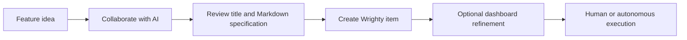
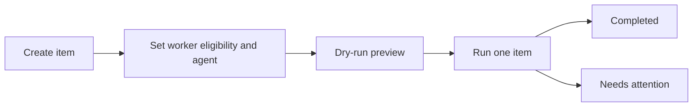
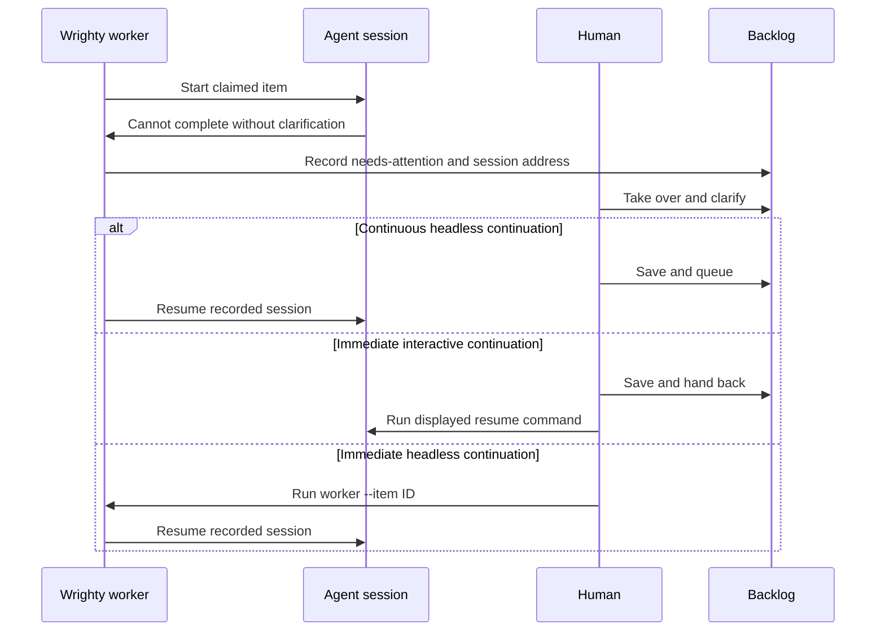

# Wrighty workflows

Wrighty supports interactive agent work, unattended worker processing, and human intervention
without making those separate systems. The CLI and Local Markdown dashboard read and mutate the
same items, claims, worker state, and recorded agent-session addresses.

You can switch between the CLI and dashboard while working on the same item. No export, import, or
synchronization step is required. Claim fencing still applies: changing surfaces does not silently
grant the new surface ownership. Use the takeover, save, release, queue, and hand-back actions
described below.

> [!IMPORTANT]
> The CLI works with both the Local Markdown and GitHub backends. `wrighty web` currently supports
> only Local Markdown. The dashboard can create Local Markdown items, but does not start workers or launch vendor agents;
> it provides inspection and human workflow controls. Where no web-only route exists, the guide
> says so explicitly.

## Choose a workflow

| Goal | Start with | Switch to the other surface when |
| --- | --- | --- |
| Inspect and organize the backlog | `wrighty list`, `wrighty get`, or `wrighty web` | You want compact/JSON output, or a visual board and Markdown preview |
| Collaboratively define a feature | Claude, Codex, or Copilot with the Wrighty skill | The item exists and you want visual editing or backlog placement |
| Give one item to an unattended agent | `wrighty worker --once` | You want to monitor state, edit requirements, take over, or archive |
| Process eligible work continuously | `wrighty worker` | An item needs human attention or backlog eligibility needs editing |
| Let an interactive agent choose work | Start Claude, Codex, or Copilot with the Wrighty skill | You want to inspect or take over the claimed item |
| Clarify a paused agent item | `wrighty edit ID --takeover` or **Take over for editing** | You prefer terminal editing or the dashboard form |

## Inspect and organize work

### CLI

List active work and inspect one item:

```shell
wrighty list
wrighty get local:42
```

The default output includes workflow status, autonomous-worker eligibility, current activity,
claim state, remaining lease, and any resumable session. A worker-originated active claim is shown
as `<Agent> processing`; this describes Wrighty's coordination state and is not a guarantee that the
vendor process is making progress. Add `--json` for scripts.

### Web dashboard

For Local Markdown, start the dashboard and select a card:

```shell
wrighty web
```

The board groups items by workflow status and highlights agent-active, queued, and
attention-required items. Select a card to inspect Markdown, worker eligibility, preferred agent,
claim attribution, and session state.

### Switching surfaces

Read-only inspection never changes ownership. You can alternate freely between `list`/`get` and
the dashboard. A dashboard refresh and the next CLI command both read the authoritative store.

## Collaboratively author a substantial work item

Use this workflow when an idea needs discussion and a structured specification rather than a
one-line title and body.



### Claude, Codex, or Copilot

Start a supported vendor surface with access to the project-scoped or user-scoped Wrighty skill,
the project, and the local Wrighty CLI. Invoke the skill using the form supported by that surface:

```text
# Codex Desktop, CLI, or IDE extension
$wrighty Help me define a new feature item. Work with me on the motivation, scope, acceptance
criteria, constraints, and verification. Show me the final proposed title and Markdown body before
creating the Wrighty item.

# Claude Code
/wrighty Help me define a new feature item. Work with me on the motivation, scope, acceptance
criteria, constraints, and verification. Show me the final proposed title and Markdown body before
creating the Wrighty item.

# Copilot surface with skill commands
/wrighty Help me define a new feature item. Work with me on the motivation, scope, acceptance
criteria, constraints, and verification. Show me the final proposed title and Markdown body before
creating the Wrighty item.
```

If a Copilot surface has no skill command, name the Wrighty skill in the prompt instead. Other
desktop surfaces are usable only when they expose the installed skill and local project tools.

The agent should collaborate without mutating Wrighty first. Once the title, body, and metadata are
settled, it generates a Creation attempt ID and creates the item using `--body-file`. If you want
the item processed unattended, authorize that separately and choose the agent:

> Create the agreed Wrighty item with autonomous processing enabled and prefer Claude.

Using Claude to author the item does not by itself authorize `--auto`, nor does selecting a
preferred agent.

After creation or a substantial clarification, the agent should not collapse the next decision to
“Want me to implement it?” When the user has not already chosen, it should offer:

| Choice | What happens |
| --- | --- |
| Start implementation in this session | The current agent claims or retains the item and implements it directly. No worker or second vendor process starts. |
| Mark for automatic processing | The agent enables worker eligibility, asks whether to use the configured `worker.defaultAgent` or pin Claude, Codex, or Copilot, then releases its editing claim. A separately running worker can pick it. |
| Do nothing for now | The item remains tracked and unscheduled. The agent explains how to return in the same conversation or use the dashboard/worker later. |

`wrighty init --check --json` exposes the configured default as
`result.worker.defaultAgent`, allowing the agent to show the actual repository default in its
choice. Selecting the default leaves the item preference unset; pinning a vendor writes the item
preference. Automatic processing still requires a worker process started separately from a
terminal.

### Direct CLI

You can use the same draft-first workflow without an interactive agent. Write and review a normal
Markdown document, then create the item:

```shell
wrighty creation-attempt new --json
wrighty create \
  --creation-attempt-id <creationAttemptId> \
  --title "Add configurable retry policy" \
  --body-file feature-requirements.md \
  --priority P1
```

Keep the body and every other create argument identical if an ambiguous result must be retried with
the same Creation attempt ID.

Draft-first avoids claim management while the specification is changing. If you deliberately want
an early tracked draft, create it with honest draft content, leave autonomous processing disabled,
claim it, and then revise it:

```shell
wrighty claim <id> --claimant-kind agent --json
wrighty edit <id> \
  --body-file feature-requirements.md \
  --claimant-id <claimantId> \
  --claim-token <claimToken> \
  --json
```

### Interactive UI

For Local Markdown, run `wrighty web`, choose **New item**, enter the structured fields, and choose
**Create item**. Creation does not claim the item or start a worker. The resulting card is selected
and the board refreshes.

For GitHub, create from the configured Project's `Todo` group or column in a board grouped by the
configured Status field. This creates the repository issue, establishes authoritative Project
membership, and initializes Status. For a Project created by `wrighty init`, Wrighty creates and
verifies an exact-name `Wrighty Board` when the host and token support the Project views endpoint.
Existing Projects are never given a new view unless you explicitly run
`wrighty init --create-view`. `wrighty init --check` only reports the compatible view or the manual
setup required.

A focused GitHub.com prototype on 2026-07-20, using REST API version `2026-03-10`, confirmed that a
new board uses the Status field for its columns by default. The REST response's empty `group_by`
array and GraphQL's empty `groupByFields` connection mean that no additional grouping is configured;
they do not mean the board lacks Status columns. Wrighty verifies the exact view name and
`BOARD_LAYOUT`, reuses a compatible view idempotently, and reports an exact-name layout conflict
without replacing it. Unsupported hosts, endpoints, and token capabilities fall back to concise
manual guidance without making the Project unusable.

Other supported GitHub-native paths are selecting the configured Project in the repository issue
composer, an issue form with `projects: ["OWNER/NUMBER"]`, a prefilled new-issue URL with
`projects=OWNER/NUMBER`, or a deliberate Project auto-add workflow using a neutral label such as
`wrighty`. Configure the built-in item-added workflow to set Status to `Todo` where needed.
Do not use `wrighty:auto` as a membership filter unless every matching item is intentionally
authorized for unattended execution.

### Switching surfaces

A common path is: collaborate in Claude Desktop or a CLI agent, create through the Wrighty skill,
inspect or refine the resulting item in the dashboard, then dispatch it from a terminal. The item
keeps its canonical ID throughout. Switching surfaces requires no synchronization, but a dashboard
editing claim must be saved and released before an ordinary worker can pick the item.

## Create and dispatch one unattended item



### CLI

Create the item with explicit unattended-execution eligibility and an agent preference:

```shell
wrighty create \
  --title "Add request validation" \
  --body-file requirements.md \
  --auto \
  --agent claude

wrighty worker --dry-run --once --workspace-mode worktree
wrighty worker --once --workspace-mode worktree
```

`--dry-run` shows the selected item, workspace, agent, prompt, and argument vector without claiming
or spawning. `--once` processes at most one item. Worktree mode is recommended for unattended work.

### Web dashboard

Create the Local Markdown item with `wrighty create` or **New item** in `wrighty web`. If it was
created without worker eligibility or an agent preference:

1. Open its card and choose **Claim for editing**.
2. Enable **Eligible for worker processing**.
3. Choose a **Preferred agent**.
4. Choose **Save and release** so a worker can claim it.

The worker itself is started from a terminal. Keep the dashboard open to monitor the card as it
moves from ready, to agent-active, to completed or attention-required.

### Switching surfaces

It is safe to create and preview through the CLI, watch the same item in the dashboard, and return
to the terminal to confirm the worker run. If the dashboard currently owns an editing claim, save
and release it before expecting a normal worker pick.

## Run a continuous unattended worker

### CLI

Start a worker that polls for eligible `Todo` items and queued resumable sessions:

```shell
wrighty worker --workspace-mode worktree --max-items 10 --idle-timeout 30m
```

The worker prints complete candidate diagnostics once, then compact idle messages. During a vendor
run it prints a single-line operational heartbeat every five minutes with elapsed time, claim
expiry, remaining item-timeout budget, and workspace mode. This remains useful in redirected or
service logs without streaming the agent transcript. In another terminal, `wrighty get <id>` shows
the durable claim/session/workspace state. Wrighty intentionally does not render live model
responses, tool calls, or reasoning.

The worker processes one child agent at a time. Start multiple workers only with isolated
worktrees, or choose `--workspace-mode shared` explicitly and accept the collision risk.

### Web dashboard

The dashboard cannot start or stop the worker process. Use it alongside the terminal to:

- see which items are eligible and which agent each prefers;
- distinguish an actively claimed agent item from a queued or attention-required item;
- change eligibility for future `Todo` work; and
- clarify and queue a paused session.

For a new unclaimed item, claim it for editing, change the worker settings, and choose
**Save and release**. For a paused recorded session, use the clarification workflow below.

### Switching surfaces

The continuous worker observes dashboard changes on later polling cycles. A dashboard edit is not
an out-of-band override: while the worker owns an active claim, the dashboard requires an explicit
takeover. That rotates the fencing token and prevents later cooperating mutations from the old
agent generation.

## Let an interactive agent choose work

### CLI and agent terminal

Install the Wrighty skill for the chosen vendor, then start the vendor interactively in the
project. Ask it to use the Wrighty skill and work the next item. The skill uses Wrighty's atomic
`pick`, reads the item, retains the returned claim handle, and calls `finish` only when the tracked
work is genuinely complete.

You can also direct the agent to a particular canonical item ID. The agent—not the human
terminal—performs the claim-aware Wrighty mutations in this workflow.

### Web dashboard

The dashboard cannot launch the interactive vendor. Once the agent has claimed an item, its card
shows the active vendor and claim state. You can inspect it without affecting the session.

Choose **Take over for editing…** only when you intend to fence the current agent from later
Wrighty mutations. Takeover does not forcibly stop an arbitrary operating-system process.

### Switching surfaces

Starting in the agent terminal and then inspecting in the dashboard is always safe. Switching from
inspection to editing requires takeover. After a human edit, use one of the hand-back choices in
the next workflow.

## Clarify an item and resume the same agent session

This is the normal recovery path when a worker reports `needs-attention`.



### CLI

Inspect the state, edit with an atomic human takeover, and queue the recorded session:

```shell
wrighty get local:42
wrighty edit local:42 --takeover --body-file requirements.md --requeue
```

An already-running continuous worker will pick the queued `In Progress` session before fresh
`Todo` work. To continue immediately instead:

```shell
wrighty edit local:42 --takeover --body-file requirements.md
wrighty worker --item local:42 --yes
```

`worker --item` infers whether it should resume an active or expired local session or start a new
one. Use `--resume` or `--fresh` only when you want Wrighty to reject any other interpretation.

### Web dashboard

1. Open the item marked **Agent needs attention**.
2. Choose **Take over for editing…** while its claim is active, or **Claim for editing** after
   expiry.
3. Clarify its title, Markdown body, eligibility, or preferred agent.
4. Choose the continuation that matches your intent:
   - **Save and queue for worker** lets a continuous worker resume the recorded session.
   - **Save and hand back to _Agent_** displays the fenced interactive resume command.
   - **Save** retains human ownership and displays a copyable headless
     `wrighty worker --item ID --resume --yes` command.
   - **Save and release** returns the item to the pool. The recorded resume address is a durable
     machine-local record and remains available for a later resume.

### Switching surfaces

You can take over and edit in the dashboard, choose plain **Save**, copy the displayed worker
command, and continue in the terminal. Conversely, after a CLI worker reports `needs-attention`,
run `wrighty web` and complete the clarification there. Claim expiry removes authorization but does
not erase a complete local vendor-session address; Wrighty can resume it under a new claim.

## Take over abandoned or conflicting work

### CLI

To clarify an item, use the combined editing operation — it acquires, recovers after expiry, or
displaces an active same-installation claimant after confirmation, then applies the edit:

```shell
wrighty edit local:42 --takeover
```

To continue the recorded agent session instead, use `wrighty worker --item local:42`.

When a script needs the raw claim handle without editing, the lower-level escape hatch remains:

```shell
wrighty takeover local:42 --yes --print-resume-command
```

Every path rotates the claim token and preserves a recorded local session address. Another
installation's active claim cannot be seized; coordinate with it or wait for the finite lease to
expire.

### Web dashboard

Open the claimed card and choose **Take over for editing…**. Wrighty explains that takeover fences
later cooperating mutations but does not stop the old process. To end the old claim without taking
it over, use **Release existing claim…**; the recorded session remains available for later resume.

### Switching surfaces

A CLI takeover is immediately visible after dashboard refresh. A dashboard takeover creates a
web-session claim, so use its Save, queue, or hand-back actions rather than copying hidden claim
tokens. Plain **Save** provides the safe command for continuing through a headless CLI worker.

## Complete, review, and archive

### CLI and agent terminal

The owning agent completes genuine tracked work with:

```shell
wrighty finish local:42
```

After a worker completes an item, its terminal output includes a vendor-specific `review:` command
when the session workspace still exists. That command opens the completed session interactively
without reacquiring the finished item. Use `--keep-workspace` with worktree mode when later review
is important.

Archive reviewed work with the exact active claim handle, or configure automatic archiving for the
finished status. Session addresses are currently stored on active claims, so releasing or finishing
removes the address from Wrighty's item state even though the vendor may retain its own history.

### Web dashboard

The dashboard can **Finish** while its web editing session owns the item. After completion, claim
the item for editing if further human changes are needed. Choose **Archive** when it should leave
the active board, and use the Archived scope to inspect or unarchive it later.

The dashboard does not currently persist or reconstruct a completed vendor session. Use the
`review:` command printed by the worker for that review.

### Switching surfaces

An agent may finish through the CLI while the dashboard is open; refresh shows the completed state.
A human may instead take over in the dashboard and choose **Finish**. Finishing is a terminal claim
operation, so do not expect the previous agent claim or resume address to remain afterward.

## Surface and ownership rules

- Read-only CLI and dashboard operations can be mixed freely.
- The current claim—not the UI being used—decides who may mutate an item.
- Takeover is explicit and rotates the fencing generation.
- Releasing an active claim also removes its recorded session/workspace address.
- **Save and queue for worker** is for continuous headless processing.
- **Save and hand back to _Agent_** is for immediate interactive continuation.
- Plain **Save** retains human ownership and offers a headless worker continuation command.
- The Local Markdown dashboard and CLI operate on the same authoritative files; GitHub users use
  the CLI and GitHub's own issue/Project views.
